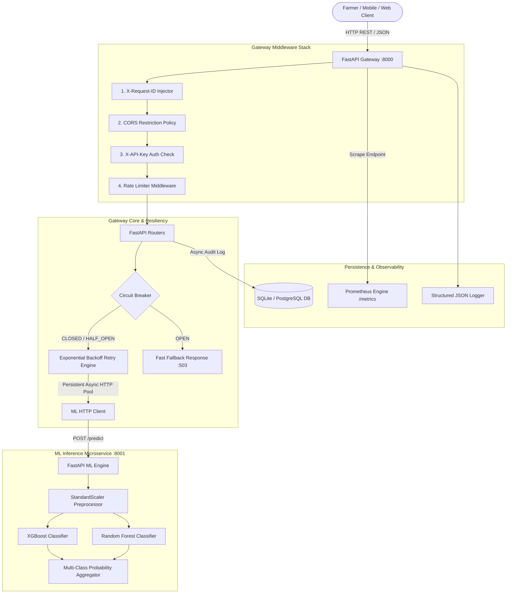
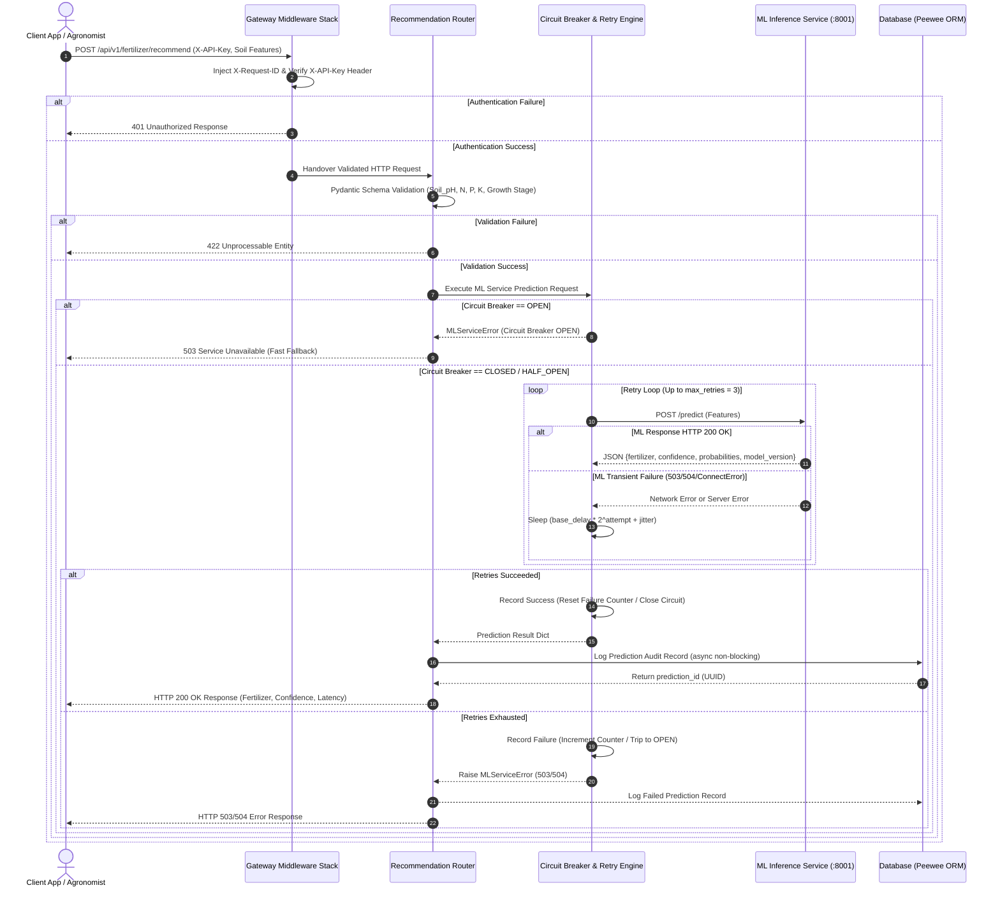
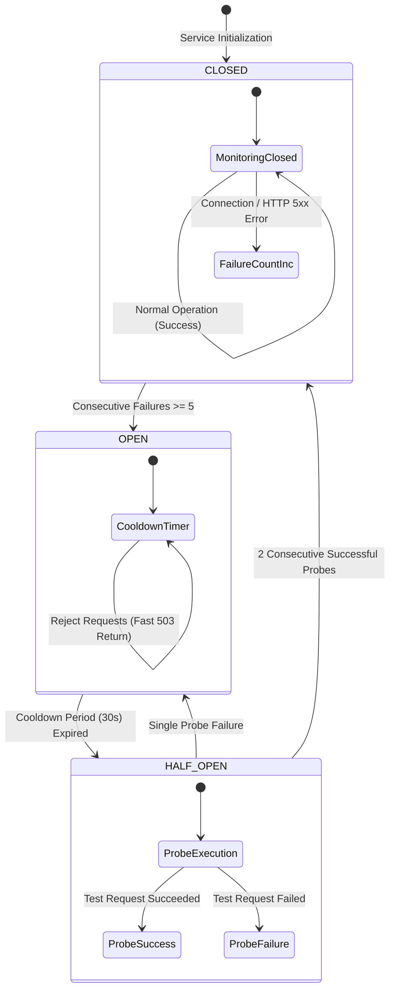
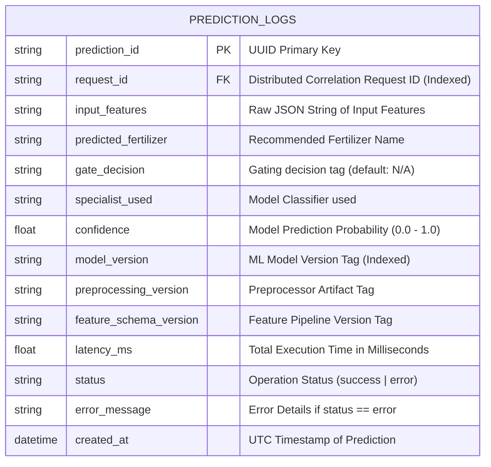
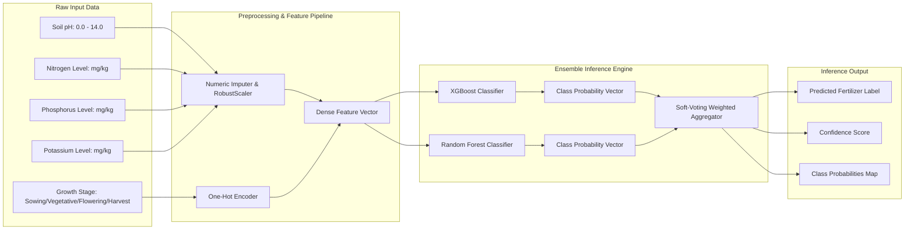

# System Architecture & Component Structure
## Fertilizer Recommendation System

---

## Executive Summary

The **Fertilizer Recommendation System** is designed following clean architecture, microservices separation of concerns, and resilient distributed systems principles. The platform decouples request routing, authentication, validation, and persistent auditing (**Backend Gateway Service**) from computationally intensive machine learning inference (**ML Inference Service**).

---

## Table of Contents

1. [High-Level Microservices Architecture](#1-high-level-microservices-architecture)
2. [End-to-End Request/Response Sequence](#2-end-to-end-requestresponse-sequence)
3. [Fault Tolerance & Circuit Breaker State Machine](#3-fault-tolerance--circuit-breaker-state-machine)
4. [Database ERD & Storage Schema](#4-database-erd--storage-schema)
5. [Machine Learning Inference Pipeline](#5-machine-learning-inference-pipeline)
6. [Complete Codebase & Directory Structure](#6-complete-codebase--directory-structure)

---

## 1. High-Level Microservices Architecture

The system consists of two primary Dockerized microservices connected over a isolated virtual bridge network (`backend_net`), backed by a persistent relational database and Prometheus metrics instrumentation:



---

## 2. End-to-End Request/Response Sequence

The sequence diagram below traces a prediction request from client initiation through authentication, resiliency checks, ML inference execution, database auditing, and telemetry emission:



---

## 3. Fault Tolerance & Circuit Breaker State Machine

To protect the Gateway from cascading outages during ML service maintenance or degradation, a state-machine Circuit Breaker is maintained in memory:



---

## 4. Database ERD & Storage Schema

All predictions are recorded in an audit table (`prediction_logs`) using Peewee ORM to support historical lookups, paginated dashboard queries, aggregated metrics, and machine learning retraining audits.



---

## 5. Machine Learning Inference Pipeline

The ML pipeline ingests numerical soil properties and categorical growth stages, transforms features, feeds them through an ensemble classification engine, and outputs normalized class confidence distributions:



---

## 6. Complete Codebase & Directory Structure

The visual hierarchy below details how code files are organized across microservice modules:

```text
Fertilizer_Recommend/
│
├── 📁 backend/                       # API Gateway FastAPI Microservice (:8000)
│   ├── 📄 main.py                    # Application entrypoint, CORS, Router mounting & lifespan
│   ├── 📄 config.py                  # Environment settings validation via pydantic-settings
│   ├── 📄 logging_config.py          # Structured JSON logging formatter & correlation engine
│   ├── 📄 Dockerfile                 # Hardened non-root Python 3.13 image for Gateway
│   │
│   ├── 📁 database/                  # Database Layer (Peewee ORM)
│   │   ├── 📄 db.py                  # PredictionLog model, connection manager & query helpers
│   │   └── 📁 migrations/            # Database schema migration engine & scripts
│   │       ├── 📄 runner.py          # Version tracking & migration execution logic
│   │       └── 📄 001_initial.py     # Initial schema creation script
│   │
│   ├── 📁 middleware/                # FastAPI Custom HTTP Middleware
│   │   ├── 📄 auth.py                # Header-based X-API-Key authentication policy
│   │   ├── 📄 request_id.py          # Distributed tracing X-Request-ID generation/propagation
│   │   └── 📄 rate_limit.py          # Sliding-window in-memory IP rate limiter
│   │
│   ├── 📁 routers/                   # REST API Endpoint Controllers
│   │   ├── 📄 recommendation.py      # POST /api/v1/fertilizer/recommend handler
│   │   ├── 📄 predictions.py         # GET /api/v1/predictions history & stats handlers
│   │   └── 📄 health.py              # GET /api/v1/health & readiness checks
│   │
│   ├── 📁 schemas/                   # Pydantic v2 Request/Response Data Validation
│   │   ├── 📄 recommendation.py      # RecommendRequest & RecommendResponse models
│   │   ├── 📄 prediction.py          # PredictionDetail & PredictionListResponse models
│   │   └── 📄 common.py              # Common API response wrappers & Error schemas
│   │
│   ├── 📁 services/                  # Business Logic & External Service Integration
│   │   ├── 📄 ml_client.py           # Resilient HTTP Client (Persistent Pool, Retries)
│   │   └── 📄 circuit_breaker.py     # Thread-safe Circuit Breaker state machine
│   │
│   └── 📁 utils/                     # Utility Helper Functions
│       ├── 📄 telemetry.py           # Prometheus metrics exporter (/metrics)
│       └── 📄 pagination.py         # Database pagination calculation helpers
│
├── 📁 ml-service/                    # ML Inference Microservice (:8001)
│   ├── 📄 main.py                    # FastAPI application exposing POST /predict & /health
│   ├── 📄 Dockerfile                 # Container setup for ML inference microservice
│   │
│   ├── 📁 inference/                 # Core Prediction Logic
│   │   ├── 📄 predictor.py           # Model loader & vectorized inference executor
│   │   └── 📄 preprocessor.py        # Feature scaling & One-Hot encoding transformer
│   │
│   ├── 📁 models/                    # Serialized Machine Learning Artifacts
│   │   └── 📁 model-v1/              # XGBoost/RF pickle artifacts & metadata JSON
│   │
│   └── 📁 schemas/                   # Data contracts for internal ML requests
│
├── 📁 training/                      # Machine Learning Training Pipeline
│   ├── 📄 train.py                   # Model training, hyperparameter tuning & artifact export
│   └── 📁 data/                      # Raw & processed agricultural soil datasets
│
├── 📁 tests/                         # Comprehensive Pytest Suite
│   ├── 📄 test_recommendation.py     # End-to-end API recommendation tests
│   ├── 📄 test_predictions_api.py    # Prediction history & pagination tests
│   ├── 📄 test_circuit_breaker.py    # Resilience & fallback unit tests
│   └── 📄 test_ml_client.py         # Async HTTP client retry tests
│
├── 📄 docker-compose.yml             # Multi-container orchestrator configuration
├── 📄 .env.example                   # Environment configuration template
├── 📄 SRS.md                         # Software Requirements Specification (IEEE 830)
├── 📄 ARCHITECTURE.md                # System Architecture & Diagram Specifications (This document)
└── 📄 README.md                      # General project overview & setup guide
```
