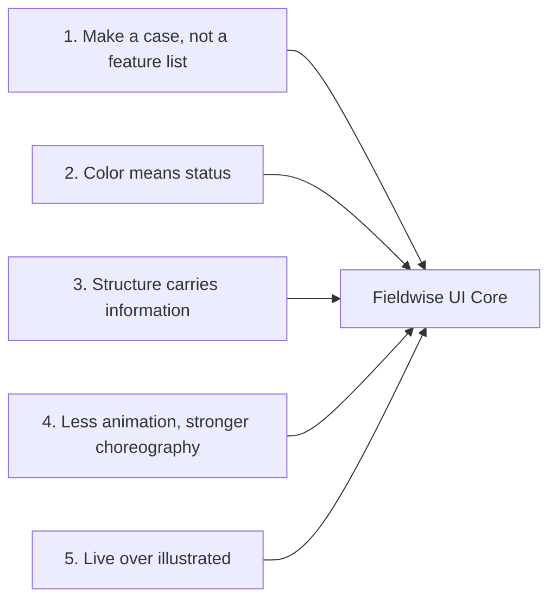
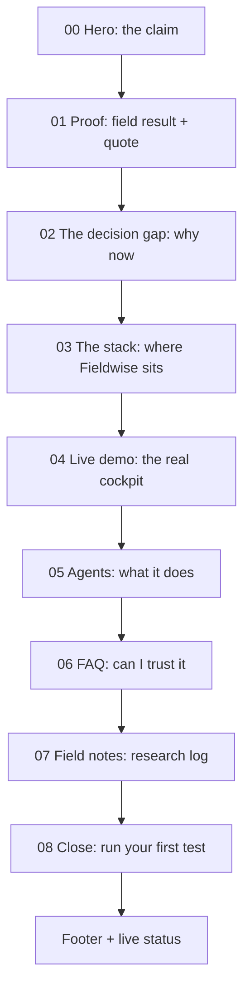

# Design System & Frontend Architecture Specification
## Fieldwise: Autonomous Fertilizer Recommendation Platform
**Version 2.1** · Narrative structure and motion architecture modeled on antimetal.com

---

## 0. What changed (read this first)

### v2.1 — Motion architecture

| Area | v2.0 | v2.1 | Why |
| :--- | :--- | :--- | :--- |
| **Motion model** | Per-section animations with a strict budget | **One scroll-progress value per scene** drives text, graphics and lines together (§10) | Antimetal's smoothness comes from choreography: everything in a scene derives from the same progress, so nothing drifts out of sync. |
| **Motion hierarchy** | Duration tokens only | 4 levels: Micro, Component, Scene, Continuous (§10.2) | Gives every animation a clear class, duration range and rule. |
| **Easing** | `cubic-bezier(0.16, 1, 0.3, 1)` everywhere | `--ease-settle: cubic-bezier(0.22, 1, 0.36, 1)` for UI settling, springs for physical movement | Slightly softer landing; generic `ease`/`ease-in-out` banned. |
| **Hero** | Text-only, no ambient graphic | Staggered settle (nav → headline → copy → CTA) + a very slow ambient field visualization | Hero feels alive before the user scrolls, without competing with the headline. |
| **Stack diagram** | Independent stacked layers | **Connected** diagram: lines draw from You → Field model → Agents → Your field as you scroll | Motion should explain the architecture, not just reveal boxes. |
| **Data sources** | Static chip row | Living network with paths drawing into the Field model | Integrations become part of the story. |
| **Agents** | 4-up card row | Sequential vertical stack entering on scroll | Reads as a pipeline, matches Antimetal's choreography. |
| **Timeline pills** | `left` / `top` per frame | `translate3d()` from CSS variables, pill and leader SVG written in the same frame | Removes layout thrash and the jump between positions. |
| **Continuous motion** | Status pulse only | Allowed at Level 4, but **pauses during scroll and drag** | Continuous motion must never fight scroll motion. |

### v2.0 — Narrative and system cleanup

| Area | v1 | v2 | Why |
| :--- | :--- | :--- | :--- |
| **Landing page** | Hero + particle canvas + product steps | A 9-section argument: claim → proof → the gap → the stack → live demo → agents → FAQ → field notes → close | Antimetal doesn't list features; it makes a case. Each section answers the next question a skeptical visitor has. |
| **Typefaces** | 4 families (Outfit, Inter, Instrument Serif, Mono) | 3 with strict roles: Instrument Serif (display), Inter (everything else), JetBrains Mono (IDs and numbers only) | Outfit and Inter are too similar to read as a deliberate pairing. A serif/sans split gives real editorial contrast. |
| **Color** | Status colors used for text and fills alike | Every status color gets a text-safe `-ink` variant; raw hues are for dots, strokes and fills only | `#10B981`, `#E5A700` and `#FF6B00` all fail WCAG AA as text on white. |
| **Radii** | 6 radius steps | 4 steps tied to hierarchy | Fewer steps make nesting rules obvious (inner radius < outer radius). |
| **Elevation** | Implicit | 3 explicit levels | Floating elements (nav, pills, popovers) need a consistent lift. |
| **Motion** | Durations and easings in prose | Motion tokens as CSS variables + one orchestrated scroll moment per page | Scattered fade-ups everywhere read as templated. One choreographed moment lands harder. |
| **Section index** | None | Numbered sections with a floating "Jump to section" index | Antimetal numbers its sections and offers section jumping; in v2 the numbers are functional anchors, not decoration. |
| **System status** | None | Live status line in footer and app shell | Mirrors Antimetal's "All systems normal" footer — a quiet trust signal that the product is live. |
| **Accessibility** | Reduced motion only | Focus rings, hit targets, slider ARIA, keyboard scrubbing, contrast table | Quality floor, not a feature. |

---

## 1. Design Vision

Fieldwise is the **autonomous layer between a grower and their soil**: it reads soil tests, weather and crop stage, recommends the exact dose, and learns from every harvest.

The interface should feel like a **precision instrument on a clean workbench**: warm paper canvas, carbon ink, hairline structure, and color that appears only when something has a status. Antimetal's lesson is that confidence comes from restraint — big plain statements, lots of air, one live product moment, and no decoration that doesn't carry meaning.

### The one memorable thing
Every page spends its boldness in exactly one place:

| Page | The memorable element | Everything else |
| :--- | :--- | :--- |
| Landing | The **Decision Gap** chart that draws itself on scroll (§7.3) | Quiet type, hairlines, generous space |
| Overview | The **Confidence Ring** resolving after a run | Dials and cards stay static and calm |
| History | The **Waveform Timeline** with physical scrubbing | Table is plain, dense, sortable |
| Audit | The **model comparison strip** | Everything tabular |

---

## 2. Design Principles



1. **Make a case, not a feature list.** Copy and layout follow the visitor's questions in order: *What is this? Does it work? Why do I need it? How does it work? Can I see it? What exactly does it do? Can I trust it?*
2. **Color means status.** The page is monochrome. Emerald, amber, blue and orange appear only to say *deployed, in review, field verified,* or *live / you are here*.
3. **Structure carries information.** Every border, number, and divider must encode something: a boundary between data groups, a step in a sequence, an anchor in the section index. If removing it loses nothing, remove it.
4. **Less animation, stronger choreography.** Movement is tied to scroll position (scenes) or to the user's own actions (drag, scrub, click). Each scene derives everything from one progress value. Ambient motion exists only at very low amplitude and pauses whenever the user scrolls or drags.
5. **Live over illustrated.** Wherever possible, show the real product (an embedded, scripted Overview cockpit) instead of a screenshot or abstract illustration.

---

## 3. Color System

### 3.1 Base palette

| Token | CSS Variable | Hex | Role |
| :--- | :--- | :--- | :--- |
| **Canvas** | `--canvas` | `#F5F5F2` | Page background, with 32px grid at 4% ink |
| **Surface** | `--surface` | `#FFFFFF` | Cards, panels, demo frame |
| **Surface Low** | `--surface-low` | `#FAFAF8` | Table headers, timeline track, FAQ open state |
| **Surface Container** | `--surface-container` | `#F0F0EC` | Pills, input fills, active segmented tab |
| **Surface Inverse** | `--surface-inverse` | `#151513` | Final CTA band and footer only |
| **Ink** | `--ink` | `#111111` | Primary text, primary buttons, major ticks |
| **Ink Secondary** | `--ink-2` | `#444444` | Subheadings, secondary button text |
| **Ink Tertiary** | `--ink-3` | `#666666` | Helper text, dates, captions |
| **Ink Inverse** | `--ink-inverse` | `#F5F5F2` | Text on `--surface-inverse` |
| **Hairline** | `--border` | `#E2E2DF` | Card borders, dividers, table rules (decorative) |
| **Border Strong** | `--border-strong` | `#8E8E89` | Input outlines, unchecked controls (≥ 3:1 on white) |

### 3.2 Status & accent colors

Each hue has two forms. Use the **raw** form for dots, strokes, rings, chart lines and fills. Use the **ink** form whenever the color is carried by text.

| Meaning | Raw (`--status-*`) | Ink (`--status-*-ink`) | Tint (`--status-*-tint`) | Usage |
| :--- | :--- | :--- | :--- | :--- |
| **Live / brand** | `#FF6B00` | `#C2410C` | `#FFF1E6` | Live pulse, playhead, "you are here", hero accent stroke |
| **Deployed / success** | `#10B981` | `#047857` | `#E8F7F0` | Deployed model, validated prediction, online node |
| **In review / warning** | `#E5A700` | `#8A6100` | `#FBF4DC` | In-review model, anomaly, advisory |
| **Field verified / info** | `#3B82F6` | `#1D4ED8` | `#EAF1FE` | Field-verified outcome, sync stream |
| **Error** | `#DC2626` | `#B91C1C` | `#FDECEC` | Failed run, invalid input |

**Rules**
- Never put white text on `#FF6B00` (2.9:1). Orange fills carry `--ink` text (6.6:1).
- A status badge is: tint background + ink-variant text + raw-color 6px dot.
- No gradients as decoration. The only gradients allowed are the leader-line fade in the timeline and the Decision Gap fill.

### 3.3 Contrast reference (checked against `--surface` and `--canvas`)

| Foreground | On white | On canvas | Passes |
| :--- | :--- | :--- | :--- |
| `--ink` `#111111` | 18.9:1 | 17.3:1 | AAA |
| `--ink-3` `#666666` | 5.7:1 | 5.2:1 | AA |
| `--status-success-ink` `#047857` | 5.5:1 | 5.0:1 | AA |
| `--status-warning-ink` `#8A6100` | 5.5:1 | 5.0:1 | AA |
| `--status-live-ink` `#C2410C` | 5.2:1 | 4.7:1 | AA |
| `--border-strong` `#8E8E89` | 3.4:1 | 3.1:1 | Non-text 3:1 |

### 3.4 Optional dark theme mapping

| Light token | Dark value |
| :--- | :--- |
| `--canvas` | `#10100F` |
| `--surface` | `#181816` |
| `--surface-low` | `#1D1D1B` |
| `--surface-container` | `#24241F` |
| `--ink` | `#EDEDE8` |
| `--ink-2` | `#BDBDB6` |
| `--ink-3` | `#8F8F88` |
| `--border` | `#2C2C28` |
| `--border-strong` | `#5E5E58` |

Status raw colors stay the same; use the raw hue as text in dark mode (they pass on dark surfaces) and drop the `-ink` variants.

---

## 4. Tokens

```css
:root {
  /* ── Spacing (4px base) ── */
  --space-1: 0.25rem;   /* 4  */
  --space-2: 0.5rem;    /* 8  */
  --space-3: 0.75rem;   /* 12 */
  --space-4: 1rem;      /* 16 */
  --space-6: 1.5rem;    /* 24 */
  --space-8: 2rem;      /* 32 */
  --space-10: 2.5rem;   /* 40 */
  --space-16: 4rem;     /* 64  — gap between blocks inside a section */
  --space-24: 6rem;     /* 96  — section padding on mobile */
  --space-40: 10rem;    /* 160 — section padding on desktop */

  --section-pad: clamp(var(--space-24), 12vw, var(--space-40));

  /* ── Radii: 4 steps, tied to hierarchy ── */
  --radius-control: 0.375rem;  /* 6  — inputs, small buttons, chips inside cards */
  --radius-card: 0.625rem;     /* 10 — cards, table containers, popovers */
  --radius-frame: 1rem;        /* 16 — demo window frame, large panels */
  --radius-pill: 9999px;       /* nav, timeline pills, status badges, CTAs */
  /* Nesting rule: inner radius = outer radius − padding (never larger than parent) */

  /* ── Elevation ── */
  --elev-0: none;
  --elev-1: 0 0 0 1px var(--border);                                        /* resting card */
  --elev-2: 0 0 0 1px rgba(17,17,17,.08), 0 1px 2px rgba(17,17,17,.04),
            0 12px 32px -16px rgba(17,17,17,.18);                          /* floating: nav, pills, popover */
  --elev-3: 0 0 0 1px rgba(17,17,17,.10), 0 24px 64px -24px rgba(17,17,17,.28); /* demo frame, modal */

  /* ── Motion: easing ── */
  --ease-settle: cubic-bezier(0.22, 1, 0.36, 1);  /* default: UI settling into place */
  --ease-out: cubic-bezier(0.16, 1, 0.3, 1);      /* large scene entrances (power3.out) */
  --ease-in-out: cubic-bezier(0.65, 0, 0.35, 1);  /* state swaps, indicator slides */
  --ease-in: cubic-bezier(0.7, 0, 0.84, 0);       /* exits only */
  /* Plain `ease`, `ease-in-out` and `linear` (except press) are not used. */

  /* ── Motion: durations by level (§10.2) ── */
  --dur-instant: 100ms;     /* press feedback */
  --dur-micro: 200ms;       /* L1: hover, focus, icon, button (150–250) */
  --dur-component: 450ms;   /* L2: cards, pills, labels, connectors (300–600) */
  --dur-scene: 900ms;       /* L3: hero, section scenes, large diagrams (600–1200) */
  --dur-ambient: 24s;       /* L4: one loop of background motion */
  --stagger: 80ms;

  /* Legacy aliases (v2.0) */
  --dur-fast: var(--dur-micro);
  --dur-base: 300ms;
  --dur-slow: 600ms;
  --dur-story: var(--dur-scene);

  /* ── Motion: distances ── */
  --rise-sm: 8px;    /* labels, metadata */
  --rise-md: 20px;   /* hero text, section text */
  --rise-lg: 30px;   /* cards entering a scene */

  /* ── Layout ── */
  --container: 75rem;    /* 1200 content width */
  --frame: 90rem;        /* 1440 outer frame with visible edge hairlines */
  --gutter: clamp(1rem, 3vw, 1.5rem);
  --nav-h: 3.5rem;

  /* ── Focus ── */
  --focus-ring: 0 0 0 2px var(--canvas), 0 0 0 4px var(--ink);
}

@media (prefers-reduced-motion: reduce) {
  :root {
    --dur-instant: 0.01ms; --dur-micro: 0.01ms; --dur-component: 0.01ms;
    --dur-scene: 0.01ms; --dur-base: 0.01ms; --dur-slow: 0.01ms;
    --stagger: 0ms;
    --rise-sm: 0px; --rise-md: 0px; --rise-lg: 0px;
    /* --dur-ambient is irrelevant: ambient loops are not started (§10.7) */
  }
}
```

---

## 5. Typography

### 5.1 Families and roles

```
Display (landing only) ──> Instrument Serif, 400, regular + italic
                           fallback: "Iowan Old Style", Georgia, serif
UI, headings, data     ──> Inter (variable), 400–650
                           font-feature-settings: "tnum", "cv11", "ss01"
                           fallback: system-ui, -apple-system, "Segoe UI", sans-serif
Machine values         ──> JetBrains Mono, 500
                           fallback: ui-monospace, SFMono-Regular, Consolas, monospace
```

**Role discipline**
- Instrument Serif appears **only** on the landing page: hero, section headlines, FAQ title, closing CTA. Never inside the app.
- Inside the app, all headings are Inter. Hierarchy comes from weight and size, not from switching family.
- Mono is for values a machine produced: `#FW-9402`, `28 ms`, `lat 28.6139`, model hashes. Not for labels, not for decoration.
- Do not emphasize a single word inside a headline with italic, bold or color. Headlines are set in one voice.

### 5.2 Scale (ratio ≈ 1.25)

| Role | Family | Size | Weight | Line height | Tracking |
| :--- | :--- | :--- | :--- | :--- | :--- |
| **Hero** | Serif | `clamp(2.75rem, 6.5vw, 5.5rem)` | 400 | 1.0 | `-0.025em` |
| **Section headline** | Serif | `clamp(2rem, 4vw, 3.25rem)` | 400 | 1.05 | `-0.02em` |
| **Lead** | Inter | `clamp(1.0625rem, 1.4vw, 1.25rem)` | 400 | 1.5 | `-0.005em` |
| **H1 (app)** | Inter | `clamp(1.5rem, 2.6vw, 2rem)` | 600 | 1.15 | `-0.02em` |
| **H2** | Inter | `1.25rem` | 600 | 1.25 | `-0.015em` |
| **H3 / card title** | Inter | `1rem` | 600 | 1.35 | `-0.01em` |
| **Body** | Inter | `0.9375rem` (15px) | 400 | 1.6 | `0` |
| **Small / table** | Inter | `0.8125rem` (13px) | 400 / 500 | 1.45 | `0` |
| **Label** | Inter | `0.75rem` (12px) | 550 | 1.3 | `0.01em` |
| **Section index** | Mono | `0.75rem` | 500 | 1 | `0` |
| **Mono value** | Mono | `0.75rem` – `0.8125rem` | 500 | 1.3 | `0` |
| **Ruler tick** | Inter | `0.625rem` (10px) | 600 | 1 | `0.06em` (uppercase allowed here only) |

**Line length:** body copy max `64ch`; lead max `52ch`; hero max `14ch`.
**Labels are sentence case.** Uppercase is reserved for ruler ticks and unit suffixes (`KG/HA`) where it aids scanning.

---

## 6. Layout Grid

- 12-column grid inside `--container` (1200px), `--gutter` gaps.
- The outer `--frame` (1440px) draws two full-height **edge hairlines** (`1px var(--border)`) on desktop. Sections attach to these lines; dividers between sections run edge to edge between them. This is the structural "drafting table" signature of the site.
- Content is **left-aligned** throughout. Only the closing CTA band is centered.
- Section rhythm: `padding-block: var(--section-pad)`; within a section, header → content gap is `--space-16`.

```
│ ┌───────────────────────── frame 1440 ─────────────────────────┐ │
│ │  02  The stack                                                │ │
│ │                                                               │ │
│ │  A new layer between you and your soil.       (serif, 7 col)  │ │
│ │  Fieldwise sits on top of the data you already…  (lead, 6 col)│ │
│ │                                                               │ │
│ │  ┌──────────── content (12 col) ───────────────────────────┐  │ │
│ ├─┴───────────────────────────────────────────────────────────┴──┤ │  ← divider runs edge to edge
```

---

## 7. Landing Page — Section by Section

The landing page is a numbered argument. Section numbers are real anchors: they drive the floating **Jump to section** index (§8.5) and the URL hash.



### 7.0 Utility bar + nav

```
┌──────────────────────────────────────────────────────────────────────┐
│ Field notes   Careers   For co-operatives                            │ ← 32px utility row, --ink-3, 13px
├──────────────────────────────────────────────────────────────────────┤
│ ◼ Fieldwise                                 Sign in   [ Book a demo ]│ ← main row, --nav-h
└──────────────────────────────────────────────────────────────────────┘
```
- On scroll past 80px, the utility row collapses (height → 0, `--dur-base`, `--ease-in-out`) and the main row becomes the floating pill nav (§8.1).
- On mobile, both rows collapse into a single bar with a menu button opening `MobileNav` as a full-height sheet.

### 7.0 Hero — the claim

```
  The right dose                       ← serif hero, max 14ch
  for every field.

  Fieldwise reads your soil tests, weather and crop stage,
  recommends exactly what to apply, and learns from every harvest.

  [ Run a soil test ]   [ See how it decides ]
     primary (ink pill)    secondary (outline pill)
```
- **The headline is the visual.** Behind it, a very quiet **ambient field**: the v1 `NetworkVisualization` canvas re-themed as soil-sample nodes on a field grid, drawn at 8–12% ink opacity, right-aligned so it never sits under the headline text.

**Page-load sequence** (one shared movement language: `opacity 0 → 1`, `y: var(--rise-md) → 0`, `--ease-settle`; nothing flies in from the side, rotates or bounces):

| Order | Element | Starts at | Duration |
| :--- | :--- | :--- | :--- |
| 1 | Nav / wordmark settles | 0ms | 400ms |
| 2 | Headline (per line, `clip-path` unmask + rise) | 120ms, +80ms per line | 700ms |
| 3 | Supporting copy | 520ms | 500ms |
| 4 | CTAs | 700ms | 400ms |
| 5 | Ambient field fades to its resting opacity | 900ms | 1200ms, then continuous |

**Ambient field rules (Level 4, §10.2)**
- Node drift ≤ 6px over a `--dur-ambient` loop; edges fade in and out slowly by proximity. No mouse repel in the hero (it competes with reading); repel is kept for the §7.3 network.
- Driven by its own `requestAnimationFrame` loop, capped at 30 FPS, paused when the hero is off-screen (IntersectionObserver) and **paused during active scroll** (resumes 150ms after the last scroll event).
- As the user scrolls out of the hero, the hero scene's progress (0 → 1 over the hero's height) drives: headline `y: 0 → -24px`, `opacity: 1 → 0.4`; field `opacity → 0`. Text and field leave together.
- Reduced motion: field renders one static frame.

- Primary CTA goes to `/overview?preset=demo`; secondary scrolls to `#stack`.

### 7.1 Proof — a field result

```
┌──────────────────────────────┬───────────────────────────────────┐
│                              │  "We cut urea by a third on the   │
│   [ video / photo still ]    │   north plots and yield held."    │
│   2:07                       │                                   │
│                              │   [Name], [Role], [Farm / Co-op]  │
└──────────────────────────────┴───────────────────────────────────┘
```
- Modeled on Antimetal's video-testimonial block: one quote, one person, one face. Not a carousel.
- Quote in serif at section-headline size minus one step. Attribution in Inter Label, `--ink-3`.
- **Motion is a pause from interface motion.** Scene progress drives the media container `scale: 0.96 → 1`, `opacity: 0 → 1` and a `clip-path: inset(6% round var(--radius-frame)) → inset(0 round var(--radius-frame))` reveal over the first 40% of the section. The quote and attribution settle (`y: var(--rise-sm) → 0`) once the media reaches full size. No sideways slides.
- The video plays only on click (poster image + duration chip `2:07` in Mono). Never autoplay with sound.
- **Use only real, consented quotes.** Until you have one, show a field-verified result instead: `−31% N applied · yield ±2% · Plot 4, Kharif 2026` with a `Field verified` blue badge.

### 7.2 The decision gap — why now

Antimetal plots "understanding needed" against "what your team can hold in their heads" and names the space between as the gap. Fieldwise's version:

```
 variables
    ▲                                  ╱  What a field's nutrient need depends on
    │                              ╱       (soil, weather, stage, history, prices)
    │                          ╱ ░░░░░
    │                      ╱ ░░░░░░░░░   Decision gap
    │                  ╱ ░░░░░░░░░░░░░
    │              ╱ ░░░░░░░░░░────────── What one soil test + a lookup chart captures
    │          ╱ ──────────
    └────────────────────────────────────▶ seasons
```
- **This is the page's memorable moment: a graph that evolves with scroll**, not an SVG that animates once. The section is pinned for ~200vh and a single `progress` (0 → 1) drives every property:

```
progress  0.00 ── 0.15 ── 0.45 ── 0.70 ── 0.85 ── 1.00
axes      draw ──┤
lower line       draws flat (what one soil test captures) ──┤
upper line              rises with "seasons" ──────────────┤
gap fill                       hatch grows between the lines ──┤
labels                                 "Decision gap" + line labels settle ──┤
copy      paragraph 1 ──────── paragraph 2 ──────── paragraph 3
```

| Property | Mapped from progress |
| :--- | :--- |
| `axisDash` | `map(p, 0, 0.15)` → `stroke-dashoffset` |
| `lowerDash` | `map(p, 0.10, 0.45)` |
| `upperDash` | `map(p, 0.15, 0.70)` (the curve visibly outruns the flat line) |
| `gapReveal` | `map(p, 0.45, 0.85)` → `clip-path` on the hatch polygon, left to right |
| `labelOpacity`, `labelY` | `map(p, 0.70, 0.85)` → `0 → 1`, `8px → 0` |
| `copyStep` | `floor(p * 3)` → which of the three paragraphs is active (others at 0.3 opacity) |

The gap visibly **widens** as the user scrolls: complexity rises, what one test captures stays flat. Implementation in §10.3.
- Below the chart, three short paragraphs in body size: the problem, what Fieldwise is, what it does. Mirrors Antimetal's "It diagnoses. It fixes. It prevents." rhythm: *It reads. It recommends. It learns.*
- Reduced motion: render the final state statically.

### 7.3 The stack — where Fieldwise sits

```
  03  The stack
  A new layer between you and your soil.

                      ┌──────────────────────┐
                      │  You                 │  goals: yield, budget, sustainability
                      └──────────┬───────────┘
                                 │  goals flow down
                      ┌──────────▼───────────┐
                      │  Field model         │  ← ink fill, inverse text
                      │  live picture of     │
                      │  every plot          │
                      └────┬──────┬──────┬───┘
                      ↙    │      │      │    ↘
           ┌───────────┐ ┌─▼────────┐ ┌──▼──────────┐
           │Soil Watch │ │ Advisory │ │Rule Builder │  ← agents, surface
           └─────┬─────┘ └────┬─────┘ └──────┬──────┘
                 └────────────┼──────────────┘
                                   ▼
                      ┌──────────────────────┐
                      │  Your field          │  plots · applications · harvests
                      └──────────────────────┘
```
- **These are connected nodes, not independent cards.** Connectors are SVG paths (`1px --ink-3`, rounded joins) living in one SVG behind the HTML nodes, so lines and boxes stay aligned at every size.
- Left column (5 col): three short blocks — *The vision*, *The field model*, *The autonomous layer*. Right column (7 col): the diagram.
- **Scene choreography** (pinned ~180vh, one `progress` drives everything):

| Progress | What happens | Left column |
| :--- | :--- | :--- |
| 0.00–0.15 | "You" node settles (`y: 20px → 0`, `opacity 0 → 1`) | *The vision* active |
| 0.15–0.30 | Connector draws down (`stroke-dashoffset → 0`); Field model node settles and its ink fill wipes in top to bottom | *The field model* active |
| 0.30–0.55 | Three branch connectors draw outward; agent nodes settle with `scale 0.94 → 1`, delayed by distance from center | |
| 0.55–0.75 | Agent connectors converge to "Your field"; field node settles | *The autonomous layer* active |
| 0.75–1.00 | A **signal dot** (4px `--status-live`) travels the path You → Field model → an agent → Your field, then a return dot travels Field → Field model in blue (*learns from the harvest*) | |

- Signal dots are the only color in the scene, and they mean "data is moving now".
- Inactive left-column blocks sit at 0.35 opacity; the active one is full ink. Text and diagram are mapped from the same progress, so they can never disagree.
- Below 900px the diagram unpins and becomes a vertical chain; each connector draws as it enters the viewport.
- Copy names things the way growers do (*soil test, weather, crop stage*), never the way the system is built (*ingestion pipeline, feature store*).

### 7.3b Data sources — a living network

```
   Soil lab ─────────┐
                     │
   Field probe ──────┤
                     ├────────▶  Field model
   Weather ──────────┤
                     │
   Satellite ────────┤
                     │
   Mandi prices ─────┘          +N more sources
```
- Sits directly under the stack, sharing the Field model node visually (same position and style) so it reads as a zoom into one part of the diagram.
- Source nodes: monochrome glyph + label, `--surface-container` pill. No colored partner logos.
- **Choreography** (scene progress over the block's height): each path draws toward the Field model (`stroke-dashoffset → 0`); its node settles with `scale 0.8 → 1`; its label with `opacity 0 → 1`, `y: var(--rise-sm) → 0`. Delay is proportional to the node's vertical distance from the center path, so the network fills from the middle outward.
- After the scene completes, a slow Level 4 pulse: one dot every ~3s travels a random source path into the Field model. Paused during scroll; off for reduced motion.
- Hover a source: its path turns `--ink` and the others dim to 0.3 (`--dur-micro`). This is the only place the radial mouse interaction from v1 survives, at 40px radius and gentle strength.

### 7.4 Live demo — the real cockpit

```
┌─ ● ● ●  Fieldwise · Overview ─────────────────────────────────────┐
│                                                                   │
│   [ pH dial ] [ N ] [ P ] [ K ]      ┌───────────────────┐        │
│   Stage: ( Sowing | V4 | R1 | Fill ) │   ◯ 97.4%         │        │
│                                      │   Apply 42 kg/ha  │        │
│   Presets: Corn N deficit · …        │   urea, split ×2  │        │
│                                      └───────────────────┘        │
└───────────────────────────────────────────────────────────────────┘
          Replay   ·   Open the full cockpit
```
- Antimetal embeds a working product demo rather than a screenshot. Fieldwise does the same: a real `<OverviewCockpit mode="demo">` inside a window frame (`--radius-frame`, `--elev-3`, 36px title bar with a muted traffic-light row and a centered title in Label style).
- **Scripted playback** starts when 50% visible (IntersectionObserver): a preset chip is pressed, dials sweep to their values (`--dur-slow` each, `--stagger` apart), the Run button presses, the confidence ring resolves. Then the demo becomes interactive — the visitor can drag any dial.
- Demo mode uses fixture data and a mocked inference call; no network.
- On mobile the frame scales to fit width; below 480px, show the result card and two dials only.

### 7.5 Agents — what it does

Section header pinned in the left column (5 col); four cards stacked vertically in the right column (7 col), joined by a short `1px --border` connector between each card so they read as one pipeline. Each card has a mode label, a name, and one sentence.

```
  05  Agents                    ┌──────────────────────────┐
  One platform.                 │ ● Proactive  Soil Watch  │
  A team of specialists.        └────────────┬─────────────┘
                                             │
  (header stays pinned while    ┌────────────▼─────────────┐
   the cards scroll past)       │ ● Reactive   Advisory    │
                                └────────────┬─────────────┘
                                             │
                                ┌────────────▼─────────────┐
                                │ ● Intelligence  Field…   │
                                └────────────┬─────────────┘
                                             │
                                ┌────────────▼─────────────┐
                                │ ● Platform  Rule Builder │
                                └──────────────────────────┘
```

**Choreography:** each card enters as its own top edge crosses 85% of the viewport: `opacity 0 → 1`, `y: var(--rise-lg) → 0`, `scale 0.98 → 1`, `--dur-component`, `--ease-settle`. The connector below it then draws down (`--dur-micro`) before the next card can enter. Small moves only — no rotation, no horizontal travel, no bounce. On mobile the header unpins and sits above the stack.

| Mode | Agent | One-liner |
| :--- | :--- | :--- |
| Proactive | **Soil Watch** | Watches each plot for nutrient drift, pH creep and missed applications. |
| Reactive | **Advisory** | Turns a new soil test or weather alert into a clear recommendation. |
| Intelligence | **Field Model** | Learns how every plot responds to what you apply, season over season. |
| Platform | **Rule Builder** | Lets an agronomist add local rules in plain language. |

- Card: `--surface`, `--elev-1`, `--radius-card`, 24px padding. Mode label is a status badge using the semantic hue where it fits (Proactive = live orange dot, Reactive = amber, Intelligence = blue, Platform = ink).
- Hover: border → `--ink`, `--dur-fast`. No lift, no shadow growth — one property changes.
- Each card links to the relevant part of the app or docs.

### 7.6 FAQ — can I trust it?

```
  06  Questions
  What growers ask before trusting Fieldwise.

  ─────────────────────────────────────────────────────────── +
  How does Fieldwise read my soil?
  ─────────────────────────────────────────────────────────── +
  Does it replace my agronomist?
  ─────────────────────────────────────────────────────────── +
  Why not just use a fertilizer chart?
  ─────────────────────────────────────────────────────────── +
  What can it do on its own?
  ───────────────────────────────────────────────────────────
```
- Native `<details>/<summary>` for accessibility. The most restrained motion on the page:
  1. Click → height expands via a layout animation (`grid-template-rows: 0fr → 1fr`, never a hard-coded height), `--dur-component`, `--ease-settle`.
  2. Answer content fades in (`opacity 0 → 1`, `y: 4px → 0`) starting 80ms after the height begins.
  3. Chevron rotates `0deg → 180deg` over the same duration.
  4. Closing runs in reverse at 70% duration with `--ease-in-out`.
- Replace each row's `+` icon from v2.0 with the chevron.
- Answers follow Antimetal's pattern: first sentence answers directly, the rest explains. Example for the last question: *"By default, nothing is applied without you. Fieldwise recommends; you or your agronomist approve each plan before it goes to the field."*
- Max text width `64ch`. Only one item open at a time is **not** enforced — let people compare answers.

### 7.7 Field notes — research log

Three cards in a row, then a "View all" link aligned to the section header.

```
┌──────────────────────────────┐
│ Research        08/03/2026   │  ← label + mono date
│                              │
│ How we predict K uptake      │  ← H3
│ from three seasons of data   │
│                              │
│ One-line summary in ink-3…   │
│                              │
│ [Author]          6 min      │
└──────────────────────────────┘
```
- Titles must describe the finding, not tease it.
- **Editorial hover**, all at `--dur-micro` with `--ease-settle`: the card content shifts `translateX(4px)`; the date and read-time go from `--ink-3` to `--ink-2`; a small arrow icon in the card's bottom-right corner moves `translateX(0 → 3px)`. The card itself doesn't lift or gain a shadow.
- If there are no posts yet, hide the section rather than show placeholders.

### 7.8 Close + footer

```
████████████████████████ surface-inverse ████████████████████████
           The autonomous layer for your fields.
     Run a soil test in two minutes. No sign-up for the demo.
              [ Run a soil test ]  [ Talk to us ]
███████████████████████████████████████████████████████████████████
  Product        Company       Resources       Legal
  Overview       About         Docs            Terms
  History        Careers       Glossary        Privacy
  Model audit    Field notes   Data sources

  ● All systems normal                       Built in [City]
```
- The closing band is the only inverse surface on the page. Primary button inverts: `--ink-inverse` fill, `--ink` text.
- **Status line**: emerald dot + "All systems normal" reads from a `/health` endpoint. States: `All systems normal` (emerald), `Degraded performance` (amber), `Inference offline` (error). The dot pulses (scale 1 → 1.6, opacity 0.6 → 0, 2s loop) only in the normal state; reduced motion disables the pulse.

---

## 8. Shared Components

### 8.1 Floating pill nav (`.floating-pill-nav`)
- Height 44px, `--radius-pill`, `rgba(245,245,242,0.82)` + `backdrop-filter: blur(20px) saturate(140%)`, `--elev-2`.
- Contains: wordmark, route segments (Overview, History, Model audit), status dot, account.
- Active segment: `--surface` fill sliding between items (shared-layout indicator, `--dur-base`, `--ease-out`). Text weight does not change on active (prevents layout shift).
- Fallback when `backdrop-filter` is unsupported: solid `--canvas` at 96%.

### 8.2 Buttons

| Variant | Fill | Text | Border | Use |
| :--- | :--- | :--- | :--- | :--- |
| Primary | `--ink` | `--surface` | none | One per view: *Run recommendation*, *Run a soil test* |
| Secondary | transparent | `--ink` | `1px --border-strong` | Alternate path: *See how it decides* |
| Ghost | transparent | `--ink-2` | none | Tertiary actions in toolbars |
| Live | `--status-live` | `--ink` | none | Landing hero accent only, if used at all |

- Height 40px (44px on touch), `--radius-pill` on marketing pages, `--radius-control` inside the app.
- Hover: primary lightens to `#2A2A2A`; secondary border → `--ink`. Press: `scale(0.98)`, `--dur-instant`.
- Labels say exactly what happens. The button "Run recommendation" produces a toast "Recommendation ready", never "Success".
- No arrow glyphs appended to button labels. (The only arrow on the site is the separate icon in field-notes cards, §7.7, where it signals "opens an article".)
- Button hover is Level 1 only: color change, no movement.

### 8.3 Status badge
`[● Deployed]` — tint background, `-ink` text, 6px raw-color dot, Label type, `--radius-pill`, padding `2px 8px`.

### 8.4 Section header
```
  03  The stack                       ← mono index (ink-3) + Inter label (ink-2)
  A new layer between you and your soil.   ← serif section headline
  Supporting line in lead size, max 52ch.  ← lead, ink-2
```
The index exists because it maps to the jump index (§8.5). Inside the app, section headers drop the index and the serif.

### 8.5 Jump-to-section index
- Fixed, bottom-left on desktop: a compact pill showing the current section (`03 The stack`). Click opens a popover listing all sections with their indices.
- Current section tracked with IntersectionObserver (`rootMargin: "-40% 0px -55% 0px"`).
- Hidden on mobile (sections are short enough to scroll).

### 8.6 Window frame
Used for the live demo and any embedded product view: `--surface`, `--radius-frame`, `--elev-3`, 36px title bar with `--border` underline. Inner content radius = `--radius-frame − padding`.

---

## 9. App Pages

### 9.1 Overview cockpit

```
┌─────────────── inputs (7 col) ───────────────┬──── result (5 col, sticky) ────┐
│  Soil test                                    │                                │
│  pH   ──────●───────────  6.4   slightly acid │    ◯  97.4%  confidence        │
│  N    ───●──────────────  48    kg/ha  low    │                                │
│  P    ─────────●────────  62    kg/ha         │    Apply 42 kg/ha urea         │
│  K    ──────────●───────  180   kg/ha         │    Split: 60% now, 40% at V6   │
│                                               │                                │
│  Crop stage  ( Sowing | V4 | R1 | Grain fill )│    Why: N below target for V4… │
│                                               │    [● In review]  #FW-9402     │
│  Presets  [Corn N deficit] [Soy acid] [Wheat K]│                                │
│                                               │    [ Save to plot ]            │
│  [ Run recommendation ]                       │                                │
├───────────────────────────────────────────────┴────────────────────────────────┤
│  Recent recommendations                         ( Timeline | List )           │
└────────────────────────────────────────────────────────────────────────────────┘
```

**Sliders (`role="slider"`)**
- Track 4px `--surface-container`; fill `--ink`; thumb 16px `--surface` with `1px --border-strong`, grows to 20px on hover/drag.
- Value readout in Mono, right-aligned, tabular. A status word after the unit (`low`, `optimal`, `high`) colored with the `-ink` variant of its status.
- Ranges: pH 3.5–9.0 (step 0.1), N 0–300, P 0–150, K 0–300 kg/ha (step 1).
- pH track shows a static 3-zone underlay (acidic / neutral / alkaline) at 6% ink — structure, not color.
- Keyboard: arrows ±1 step, Shift+arrows ±10 steps, Home/End to range limits. `aria-valuetext="6.4, slightly acidic"`.

**Result card states**

| State | Visual | Copy |
| :--- | :--- | :--- |
| Empty | Ring outline only, `--border` | "Set your soil values and run a recommendation." |
| Running | Ring stroke sweeps indeterminately; card content at 40% opacity | "Reading soil and weather…" |
| Ready | Ring fills to confidence (`--dur-slow`, `--ease-out`), counter counts up | Dose, split, reason, status badge |
| Low confidence (< 85%) | Ring in amber | "Confidence is low. A fresh soil test for K would help." |
| Error | Ring in error red, static | "Couldn't reach the model. Your inputs are saved — try again." |

**Watch feed (new, optional):** below the result, a quiet list of Soil Watch observations — `Plot 4 · K trending down over 3 tests · 2d ago` — each with a status dot. Mirrors Antimetal's "agents act continuously" story inside the product.

### 9.2 History — Waveform Timeline (WV)

The DOM structure from v1 is retained. **Positioning changes in v2.1:** pills no longer move by writing `left` and `top`. Writing those every frame forces layout and causes the visible jump between, for example, `left: 424.987px; top: 803.819px` and `left: 644.724px; top: 824.889px`.

**Pipeline (one frame)**
```
timeline progress / pan offset
        ↓
compute targetX, targetY for each pill (tiering, §below)
        ↓
spring step toward target   (or lerp fallback)
        ↓
write --x, --y, --scale, --opacity on the pill
write the leader path "d" in the SAME frame
        ↓
pill + leader + anchor dot move together
```

**Updated `.wv-pill` contract**
```css
.wv-pill {
  --x: 0px;            /* written by the rAF loop */
  --y: 0px;
  --scale: 1;
  --opacity: 1;
  --wv-pill-size: 0.88;
  --wv-pill-bg: rgba(255, 255, 255, 0.94);
  --wv-pill-text: #1a1714;
  --wv-pill-border: rgba(17, 17, 17, 0.12);
  --wv-pill-dot: var(--status-success);

  position: absolute;
  left: 0;             /* fixed — never animated */
  top: 0;
  transform:
    translate3d(var(--x), var(--y), 0)
    translate(-50%, -50%)
    scale(var(--scale));
  opacity: var(--opacity);
  will-change: transform, opacity;
  /* remaining visual properties as in v1 */
}
```
For maximum performance, the loop can write `el.style.transform` directly instead of custom properties; keep the custom-property form when other CSS needs to read the values.

**Motion parameters**

| Parameter | Value | Notes |
| :--- | :--- | :--- |
| Pill follow | spring `stiffness 220, damping 30, mass 1` | Fallback lerp `0.12` per frame at 60 FPS; make it frame-rate independent: `t = 1 − (1 − 0.12)^(dt / 16.67)` |
| Release inertia | velocity × `0.92` per frame | Light inertia; stops when `|v| < 0.05 px/frame` |
| Snap | nearest keyframe within 48px, spring `stiffness 260, damping 32` | Critically damped, no overshoot |
| Entry | `--scale 0.4 → 1` (vertical squash from v1 replaced by uniform scale), `--opacity 0 → 1`, `--dur-component` | Leader path draws from track dot to pill as it grows |
| Exit | reverse at 70% duration, `--ease-in` | |

**Rules**
- Pill, leader path, and both anchor dots read from the same interpolated `currentX/currentY`. Never interpolate them separately.
- React state updates only on settle (selected inference, URL param). Everything per-frame lives in refs.
- The ambient loops elsewhere on the page are paused while the user drags (§10.6).

**Interaction**
- **Keyboard:** the interactive area is `role="slider"` with `aria-valuetext` = the focused inference (`"#FW-9402, 12 Sep, 97.4% confidence"`). ←/→ step to previous/next inference; Shift+←/→ jump one day; `+`/`−` zoom; Space toggles play.
- Wheel: vertical wheel zooms around the pointer; horizontal wheel or Shift+wheel pans.
- `touch-action: pan-y` on the wrapper so mobile users can still scroll the page; `touch-action: none` only after a horizontal drag is detected (8px threshold).

**Collision avoidance (greedy tiering)**
```
sort pills by x
for each pill:
  tier = lowest t in [0,1,2] where |x − lastX[t]| ≥ pillWidth[t] + 12px
  if none: collapse into a "+n" cluster pill on tier 0
  lastX[tier] = x
y = trackY − (65 + 52·tier)px
```
- A tier change only changes `targetY`; the spring carries `--y` there, so tier moves glide like any other motion. Pills never swap tiers mid-drag (hysteresis of 16px).

**Level of detail by zoom**

| Zoom | Pill shows |
| :--- | :--- |
| Far | Dot + status only, clustered "+n" pills |
| Mid | Crop + confidence |
| Near | Crop, confidence, date, stage chip, latency (mono) |

**Playhead:** 1px `--status-live` needle with a 6px cap; the current-time badge above it uses Mono.

**Empty state:** "No recommendations yet. Run your first one from Overview." + secondary button "Go to Overview".

**Table sync:** hovering a table row highlights its node and leader line; focusing a node scrolls the row into view (`scroll-margin-top: calc(var(--nav-h) + 16px)`), and the row expands to show inputs, model version and outcome.

### 9.3 Model audit
- One comparison strip across the top (the page's memorable element): each model version as a column with deployed/in-review badge, accuracy, field-verified rate, median latency in Mono.
- Below: plain table, sortable, 13px, `--surface-low` header, hairline rows, no zebra striping.

---

## 10. Motion Architecture

### 10.1 The core idea: one progress value per scene

Don't build "section 1 animation, section 2 animation, section 3 animation". Build **scenes**, where every moving part derives from one number.

```
                 SCROLL POSITION
                       │
                 scene.progress (0 → 1)
          ┌────────────┼────────────┐
          ↓            ↓            ↓
        text        graphics      lines
          ↓            ↓            ↓
   opacity, y     transform    stroke-dashoffset
          └────────────┼────────────┘
                   ONE SCENE
```

Because text, diagrams and connectors read the same `progress`, they can't drift out of sync, they reverse correctly when the user scrolls back up, and the page feels like one continuous piece rather than a pile of effects.

**Scene map (landing)**

| Scene | Section | Pinned | Length | Drives |
| :--- | :--- | :--- | :--- | :--- |
| `hero-exit` | 7.0 | no | hero height | headline drift, field fade |
| `proof` | 7.1 | no | section height | media scale/clip, quote settle |
| `gap` | 7.2 | yes | ~200vh | axes, both lines, gap fill, labels, paragraphs |
| `stack` | 7.3 | yes | ~180vh | nodes, connectors, signal dots, left-column steps |
| `sources` | 7.3b | no | block height | paths, nodes, labels |
| `agents` | 7.5 | header only | section height | per-card thresholds |

Sections 7.4 (demo), 7.6 (FAQ) and 7.7 (field notes) are **interaction-driven**, not scroll-driven.

### 10.2 Motion hierarchy

| Level | Duration | Used for | Rule |
| :--- | :--- | :--- | :--- |
| **L1 Micro** | 150–250ms (`--dur-micro`) | hover, press, focus, icons, small text shifts | Changes one or two properties. Never moves layout. |
| **L2 Component** | 300–600ms (`--dur-component`) | cards, pills, labels, SVG connectors, accordion | Settles with `--ease-settle` or a spring. |
| **L3 Scene** | 600–1200ms (`--dur-scene`) or scroll-scrubbed | hero sequence, gap chart, stack diagram | Driven by scene progress; reversible. |
| **L4 Continuous** | very slow (`--dur-ambient`, 20–30s loops) | hero field, source pulse, status pulse | Low amplitude, low opacity, **pauses during scroll and drag**. |

**Continuous motion never fights scroll motion.** If a user is scrolling or dragging, L4 loops pause; they resume 150ms after input stops, easing back in over 400ms.

### 10.3 Implementation: scene progress

```ts
// motion/scene.ts
export const clamp = (v: number, a = 0, b = 1) => Math.min(b, Math.max(a, v));
export const map = (p: number, start: number, end: number) =>
  clamp((p - start) / (end - start));

// Progress of a section through the viewport
export function sceneProgress(el: HTMLElement) {
  const r = el.getBoundingClientRect();
  const travel = r.height - window.innerHeight;          // pinned scenes: scroll length
  return clamp(-r.top / Math.max(travel, 1));
}
```

Preferred: let GSAP ScrollTrigger compute progress and pin, then route it through one `onUpdate` that writes every property:

```ts
gsap.matchMedia().add("(prefers-reduced-motion: no-preference)", () => {
  ScrollTrigger.create({
    trigger: "#gap",
    start: "top top",
    end: "+=200%",
    pin: true,
    scrub: 0.6,                       // light smoothing, still feels 1:1
    onUpdate: ({ progress: p }) => {
      lowerPath.style.strokeDashoffset = `${(1 - map(p, 0.10, 0.45)) * lowerLen}`;
      upperPath.style.strokeDashoffset = `${(1 - map(p, 0.15, 0.70)) * upperLen}`;
      gapHatch.style.clipPath = `inset(0 ${(1 - map(p, 0.45, 0.85)) * 100}% 0 0)`;
      const l = map(p, 0.70, 0.85);
      gapLabel.style.opacity = `${l}`;
      gapLabel.style.transform = `translateY(${(1 - l) * 8}px)`;
      setActiveParagraph(Math.min(2, Math.floor(p * 3)));   // only state that changes discretely
    },
  });
});
```

- One `onUpdate` per scene; no separate tweens per element.
- `setActiveParagraph` should only touch the DOM when the index actually changes.
- Without ScrollTrigger, use the `sceneProgress` helper inside one shared `requestAnimationFrame` loop fed by a passive scroll listener.

### 10.4 Easing

| Use | Curve |
| :--- | :--- |
| UI settling (default) | `--ease-settle` `cubic-bezier(0.22, 1, 0.36, 1)` |
| Large scene entrances | `--ease-out` `cubic-bezier(0.16, 1, 0.3, 1)` |
| Indicator slides, state swaps | `--ease-in-out` `cubic-bezier(0.65, 0, 0.35, 1)` |
| Exits | `--ease-in` |
| Physical (drag, snap, pills) | spring: medium stiffness (200–260), high damping (28–32), mass 1 |
| Scroll-scrubbed scenes | linear mapping of progress, smoothed by `scrub: 0.6` |

Plain `ease` and `ease-in-out` are not used anywhere.

The physical feel to aim for on release:
```
drag     ████████████████→
release                  ╲
                          ╲__
                             ╲____      (decays, settles)
not:                     |
                         | stop         (dead stop)
```

### 10.5 Movement vocabulary

One shared language across the site: **opacity + small rise + slight scale**.

| Allowed | Values |
| :--- | :--- |
| Rise | `--rise-sm` 8px (labels), `--rise-md` 20px (text), `--rise-lg` 30px (cards) |
| Scale | `0.94–0.98 → 1` for nodes and cards; `0.96 → 1` for media; `0.8 → 1` for small network nodes |
| Reveal | `clip-path: inset()` unmask, top-to-bottom or left-to-right |
| Draw | `stroke-dashoffset → 0` on connectors and chart lines |

| Not allowed | |
| :--- | :--- |
| Horizontal fly-ins from the side | |
| Rotation (except chevrons and the FAQ icon) | |
| Bounce / overshoot on UI elements | |
| Different entrance directions for sibling elements | |
| Time-based fade-ups that run regardless of scroll position | |
| Hover lift + shadow growth on cards | |

### 10.6 Interaction-driven motion

| Interaction | Duration | Easing |
| :--- | :--- | :--- |
| Hover, focus, toggle | `--dur-micro` | `--ease-settle` |
| Press | `--dur-instant` | linear |
| Accordion, tab content | `--dur-component` | `--ease-settle` |
| Segmented / nav indicator | `300ms` | `--ease-in-out` |
| Confidence ring, counters | `600ms` | `--ease-out` (GSAP `power3.out`) |
| Table row stagger | `--stagger` between rows, max 8 rows animated | `power2.out` |
| Timeline drag / snap / pills | spring (§9.2) | — |

During any drag (timeline, sliders, demo dials) a global `isInteracting` flag pauses L4 loops.

### 10.7 Performance & reduced motion

- Animate only `transform`, `opacity`, `clip-path`, `stroke-dashoffset`. Never `left`, `top`, `width`, `height` per frame.
- One `requestAnimationFrame` loop per page (shared scheduler), not one per component. Scroll listeners are passive and only record `scrollY`; the loop does the work.
- Cache path lengths (`getTotalLength()`) and element rects on resize, not per frame.
- `will-change` only on elements currently animating; remove it when a scene completes.
- **Reduced motion** (`gsap.matchMedia()` with `(prefers-reduced-motion: reduce)`): no pinning, no scrubbing, no L4 loops. Every scene renders its final state (progress = 1); interactive components snap instantly; signal dots and pulses are hidden. Content and order are identical, so nothing is lost.

---

## 11. Responsive Behavior

| Breakpoint | Landing | App |
| :--- | :--- | :--- |
| **> 1200px** | Edge hairlines visible; stack is sticky two-column; agents 4-up | Inputs 7 col / result 5 col sticky; full table |
| **900–1200px** | Hairlines hidden; stack two-column, not sticky; agents 2×2 | 2-column, timeline 320px tall |
| **768–900px** | Stack becomes a vertical list with each layer revealed in place | Single column; result card moves above Recent |
| **< 768px** | Utility row hidden; demo frame shows result + 2 dials; jump index hidden | `MobileNav` sheet; 44px hit targets; table shows crop, dose, confidence, status only |

Hero type scales by `clamp()` alone; no breakpoint-specific font sizes elsewhere.

---

## 12. Accessibility Floor

- Visible focus on every interactive element via `--focus-ring` using `:focus-visible`.
- Minimum hit target 44×44px on touch, 32×32px on pointer.
- All status is carried by text as well as color (badge label, status word after slider values).
- Sliders and timeline expose `aria-valuemin/max/now/valuetext`.
- Live demo: `aria-hidden="true"` on the scripted playback layer; the "Open the full cockpit" link is the accessible path.
- Charts (gap chart, confidence ring) have an adjacent text equivalent or `aria-label`.
- Color contrast per §3.3.

---

## 13. Writing Guidelines

- Name things the way growers do: *soil test, dose, plot, crop stage* — not *payload, inference job, entity*.
- Sentence case everywhere. No exclamation marks.
- One action keeps one name through the flow: *Run recommendation* → *Running…* → *Recommendation ready*.
- Errors say what happened and what to do; they don't apologize. *"Couldn't reach the model. Your inputs are saved — try again."*
- Empty states invite the next action.
- Antimetal-style headline rhythm: a short declarative claim, then one line that explains it. No stacked adjectives.

---

## 14. Performance & Quality Benchmarks

- 60 FPS sustained during timeline drag and scroll-linked sections (verify in Chrome Performance panel with 4× CPU throttle).
- LCP < 2.0s on the landing page: the hero headline is the LCP element (the ambient canvas starts after load and never blocks it), fonts preloaded (`Instrument Serif 400`, `Inter variable`), `font-display: swap` with metric-matched fallbacks (`size-adjust`) to avoid layout shift.
- Live demo and GSAP ScrollTrigger are lazy-loaded when within 1 viewport of the section.
- CLS < 0.05: reserve space for the demo frame and chart with `aspect-ratio`.
- Vite build; route-level code splitting for Overview, History, Audit.
- `oxlint` 0 errors; `tsc -b` strict passes.

### Motion scorecard

| Area | Target | How to verify |
| :--- | :--- | :--- |
| Scroll smoothness | 60 FPS through every pinned scene | Performance panel, 4× CPU throttle, no long tasks > 50ms |
| Drag response | Pill moves on the first frame after pointer move | No `pointermove` → paint gap > 16ms |
| Label movement | Interpolated, never jumps | Record at 0.25× speed; no frame-to-frame jumps > 40px |
| Leader SVG | Moves in the same frame as its pill | Path end and pill center match within 1px at every frame |
| Section reveals | Progressive and reversible | Scroll back up: every scene rewinds cleanly |
| Hover | Subtle, ≤ 2 properties, ≤ 250ms | Code review against §10.2 L1 |
| Inertia | Light; stops within ~600ms | Fling test on trackpad and touch |
| Springs | No visible overshoot on UI | Visual check at 0.25× speed |
| Background | Very slow, pauses on scroll and drag | Toggle `isInteracting` and watch the loop stop |
| Layout shift | Zero during animation (CLS 0 for scenes) | Layout Shift regions in DevTools |
| Mobile gestures | Page scroll still works over the timeline | Vertical swipe over timeline scrolls the page |
| Reduced motion | Final states, no pinning, no loops | Emulate `prefers-reduced-motion` in DevTools |

---

## 15. Implementation Checklist

1. Replace `:root` tokens with §4, including the v2.1 motion tokens; add `-ink` and `-tint` status variants (§3.2).
2. Swap Outfit for Inter in app headings; restrict Instrument Serif to landing.
3. Build the shared motion layer first: `motion/scene.ts` (`clamp`, `map`, `sceneProgress`), a single rAF scheduler, the global `isInteracting` flag, and the `gsap.matchMedia()` reduced-motion split (§10.3, §10.7).
4. Hero: staggered settle sequence, then re-theme `NetworkVisualization` as the slow ambient field with scroll/off-screen pausing (§7.0).
5. Build sections 01–08 in order; wire section indices to the jump index and URL hashes.
6. Gap scene: pinned, one `onUpdate`, gap visibly widens with progress (§7.2).
7. Stack scene: connected SVG diagram behind HTML nodes, connectors drawing in order, signal dots last (§7.3); then the living source network (§7.3b).
8. Agents: pinned header, vertical card stack with per-card thresholds (§7.5).
9. Wrap `OverviewCockpit` with a `mode="demo"` prop using fixtures; embed it in the window frame.
10. FAQ chevron + layout animation; field-notes editorial hover.
11. Timeline: move pills from `left`/`top` to `translate3d()`, write pill and leader in the same frame, switch to springs, add keyboard support, greedy tiering with clustering, LOD by zoom, and the `touch-action` fix (§9.2).
12. Add the footer status line backed by `/health`.
13. Audit every animation against §10.2 and §10.5; delete anything that isn't scene-driven or user-driven.
14. Run the motion scorecard (§14), contrast table and focus-ring check on every page.