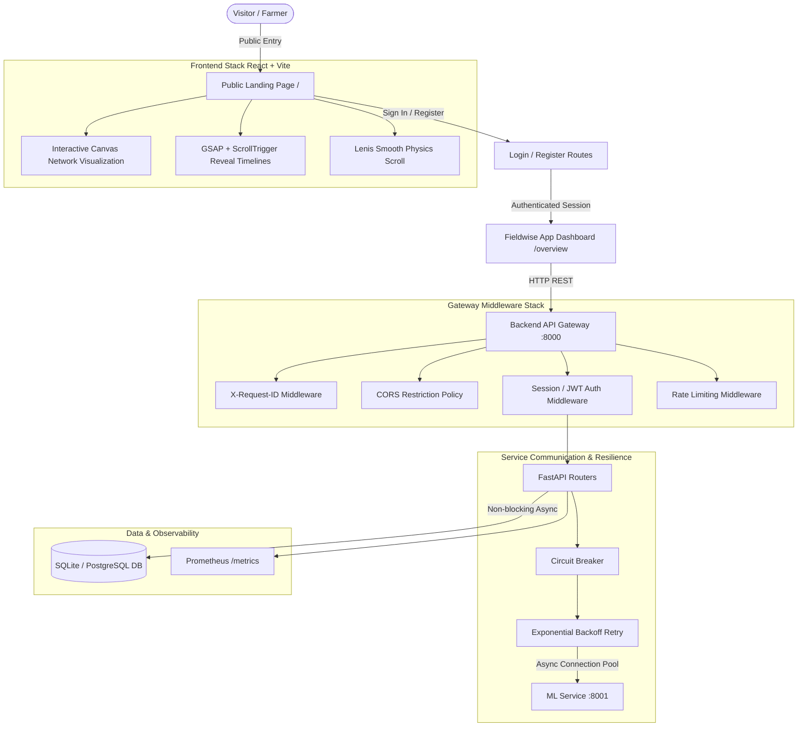

# 🌱 Fertilizer Recommendation System

[](https://www.python.org/)
[](https://fastapi.tiangolo.com/)
[](https://www.docker.com/)
[]()

A production-grade, highly resilient microservices platform designed to recommend optimal fertilizers based on soil composition, crop types, and growth stages. Built with **FastAPI**, **Scikit-Learn/XGBoost**, **Peewee ORM**, and containerized using **Docker & Docker Compose**.

---

## 🏛️ System Architecture

The repository is structured following modern microservice & clean architecture principles:



---

## ✨ Key Features

- **Editorial Public Landing Page (`frontend/`)**:
  - **Public Entry Point (`/`)**: High-converting editorial landing page inspired by modern AI startup aesthetics (warm off-white `#DCDDD7` canvas, near-black primary text, subtle `#FF6B00` warm orange accent).
  - **Interactive HTML5 Canvas Network (`NetworkVisualization.tsx`)**: Physics-backed node network featuring organic floating drift, magnetic cursor attraction/repulsion, node clustering, and a highlighted central node with an orange accent ring.
  - **GSAP & ScrollTrigger Animations**: Staggered hero entrance timeline, line-by-line text reveals, feature card entrance triggers, and metric counters.
  - **Lenis Smooth Scroll**: Integrated physics-based smooth scrolling synced seamlessly with GSAP tickers.
  - **Responsive Floating Navigation (`LandingNavbar.tsx`)**: Glassmorphic pill-shaped header with smooth section scrolling and mobile overlay drawer.

- **Frontend Application & Dashboard**:
  - **Overview Dashboard (`/overview`)**: Real-time NPK input telemetry, interactive fertilizer prescription engine, and deficiency breakdown charts.
  - **Prediction History (`/history`)**: Log of past predictions with filtering, telemetry parameters, and export capabilities.
  - **Model Audit (`/audit`)**: Governance metrics, XGBoost vs. Random Forest confidence scores, feature importance matrices, and latency tracking.

- **API Gateway Layer (`backend/`)**:
  - **Header Authentication (`X-API-Key`)**: Protects recommendation and prediction history APIs while keeping operational health endpoints public.
  - **ML Service Resiliency**: Integrated **Exponential Backoff Retry** (`503`, `504`, `ConnectError`) and **Circuit Breaker** state machine (`CLOSED` ➔ `OPEN` ➔ `HALF_OPEN`) to prevent cascading failures.
  - **Observability**: End-to-end `X-Request-ID` correlation, structured JSON logging, and Prometheus metrics (`/metrics`).
  - **Database Migration Engine**: Version-controlled Peewee schema migrations (`backend/database/migrations/`).
  - **Configuration Validation**: Type-safe environment validation via `pydantic-settings`.

- **ML Inference Engine (`ml-service/`)**:
  - Served via lightweight FastAPI endpoint (`POST /predict`).
  - Hierarchical model architecture using trained XGBoost and Random Forest classifiers (`models/model-v1/`).

---

## 📁 Directory Structure

```text
Fertilizer_Recommend/
├── frontend/                 # React 19 + TypeScript + Vite Frontend Application
│   ├── src/
│   │   ├── components/
│   │   │   ├── landing/      # LandingNavbar, HeroSection, NetworkVisualization, ProductOverview, LandingFooter
│   │   │   ├── Navbar.tsx    # App navigation header
│   │   │   └── MobileNav.tsx # Mobile navigation bar
│   │   ├── context/          # AuthContext session management
│   │   ├── pages/            # LandingPage (/), OverviewPage, PredictionHistoryPage, ModelAuditPage, LoginPage, RegisterPage
│   │   ├── services/         # Axios API client & endpoints
│   │   ├── App.tsx           # Router configuration
│   │   ├── main.tsx          # App entrypoint
│   │   └── index.css         # Fieldwise design system & editorial typography
│   ├── index.html            # Google Fonts (Instrument Serif, Inter, Outfit)
│   └── package.json          # Dependencies (GSAP, Lenis, Lucide-React, React Router 7)
├── backend/                  # FastAPI Gateway service
│   ├── database/             # Peewee ORM & migrations
│   ├── middleware/           # Auth, Request ID, Rate limit
│   ├── routers/              # Modular API router endpoints
│   ├── schemas/              # Pydantic request/response models
│   ├── services/             # ML HTTP client & Circuit Breaker
│   └── main.py               # FastAPI entrypoint & lifespan
├── ml-service/               # ML Inference microservice
├── training/                 # Model training & preprocessing scripts
├── tests/                    # Comprehensive unit & integration test suites
├── docker-compose.yml        # Multi-container orchestrator configuration
└── README.md                 # System documentation
```

---

## 🚀 Quick Start & Setup

### Prerequisites

- **Python 3.13+**
- **Docker & Docker Compose** (optional for containerized setup)

### 1. Environment Configuration

Copy `.env.example` to `.env`:

```bash
cp .env.example .env
```

Default environment parameters:

```env
API_KEY=dev-secret-key-123
ML_SERVICE_URL=http://localhost:8001
DATABASE_URL=sqlite:///./predictions.db
LOG_LEVEL=INFO
LOG_FORMAT=human
```

### 2. Local Installation

```bash
# Clone the repository
git clone https://github.com/Sarthak-Pandey/Fertilizer_Recommandation.git
cd Fertilizer_Recommandation

# Install backend dependencies
pip install -r backend/requirements.txt
```

### 3. Run via Docker Compose (Recommended)

Start all services in detached mode:

```bash
docker-compose up --build -d
```

Services will be accessible at:
- **Backend Gateway**: `http://localhost:8000`
- **Interactive OpenAPI Docs**: `http://localhost:8000/docs`
- **ML Service**: `http://localhost:8001`

---

## 🧪 Testing

Execute the complete automated test suite using `pytest`:

```bash
pytest
```

---

## 📜 API Usage Example

### 1. Check System Health (Public)

```bash
curl -X GET http://localhost:8000/api/v1/health
```

### 2. Request Fertilizer Recommendation (Protected)

```bash
curl -X POST http://localhost:8000/api/v1/fertilizer/recommend \
  -H "Content-Type: application/json" \
  -H "X-API-Key: dev-secret-key-123" \
  -d '{
    "Soil_pH": 6.5,
    "Nitrogen_Level": 40.0,
    "Phosphorus_Level": 20.0,
    "Potassium_Level": 30.0,
    "Crop_Growth_Stage": "Vegetative"
  }'
```

**Response**:

```json
{
  "success": true,
  "fertilizer": "Urea",
  "confidence": 0.95,
  "model_version": "model-v1",
  "prediction_id": "8f3b2a1c-...",
  "latency_ms": 12.45
}
```

---

## 🛡️ License

Distributed under the MIT License. See `LICENSE` for more information.
