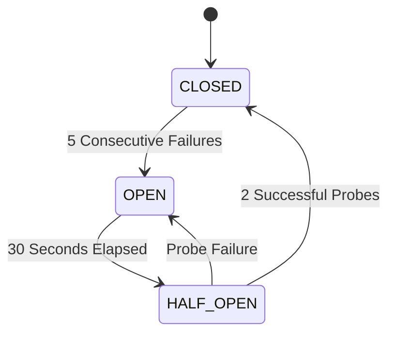
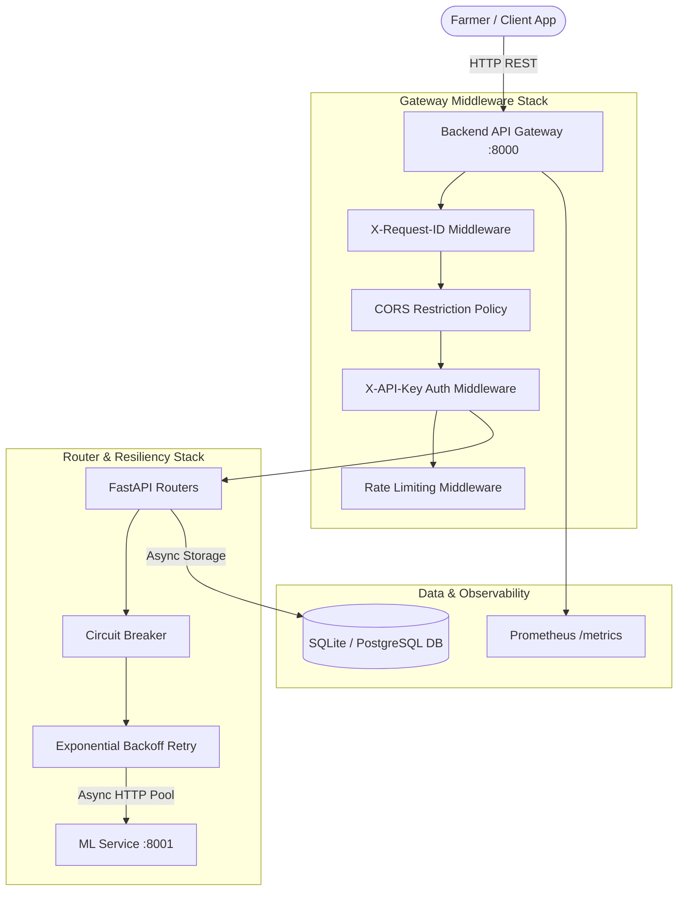

# Software Requirements Specification (SRS)
## Fertilizer Recommendation System

---

### Document Control

| Attribute | Details |
| :--- | :--- |
| **System Name** | Fertilizer Recommendation System |   
| **Document Version** | 1.0.0 |
| **Status** | Approved / Production Ready |
| **Architecture** | Microservices (API Gateway + ML Inference Service) |
| **Tech Stack** | Python 3.13+, FastAPI, XGBoost/Scikit-Learn, Peewee ORM, SQLite/PostgreSQL, Docker |

---

## Table of Contents

1. [Introduction](#1-introduction)
   - 1.1 [Purpose](#11-purpose)
   - 1.2 [Scope](#12-scope)
   - 1.3 [Overview](#13-overview)
2. [General Description](#2-general-description)
   - 2.1 [Functions](#21-functions)
   - 2.2 [User Community](#22-user-community)
3. [Functional Requirements](#3-functional-requirements)
   - 3.1 [Possible Outcomes](#31-possible-outcomes)
   - 3.2 [Ranked Order](#32-ranked-order)
   - 3.3 [Input-Output Relationship](#33-input-output-relationship)
4. [User Interface Requirements](#4-user-interface-requirements)
   - 4.1 [Software Interfaces](#41-software-interfaces)
   - 4.2 [Examples](#42-examples)
5. [Performance Requirements](#5-performance-requirements)
   - 5.1 [Response Time](#51-response-time)
   - 5.2 [Throughput](#52-throughput)
   - 5.3 [Scalability](#53-scalability)
6. [Non-Functional Attributes](#6-non-functional-attributes)
   - 6.1 [Usability](#61-usability)
   - 6.2 [Reliability](#62-reliability)
   - 6.3 [Security](#63-security)
7. [Schedule and Budget](#7-schedule-and-budget)
   - 7.1 [Timeline](#71-timeline)
   - 7.2 [Cost Estimate](#72-cost-estimate)
8. [Appendices](#8-appendices)
   - 8.1 [Supplementary Information](#81-supplementary-information)
   - 8.2 [Glossary](#82-glossary)

---

## 1. Introduction

### 1.1 Purpose
The purpose of this Software Requirements Specification (SRS) document is to provide a complete, precise, and authoritative specification of the **Fertilizer Recommendation System**. This system is an enterprise-grade, cloud-native microservices platform that analyzes soil nutrient levels, pH values, environmental factors, and crop growth stages to predict and recommend optimal fertilizers. This document is intended for system architects, software developers, ML engineers, QA testers, and agricultural domain administrators.

### 1.2 Scope
The **Fertilizer Recommendation System** encompasses:
- **API Gateway Service (`backend/`)**: Built with FastAPI to handle HTTP request routing, rate limiting, authentication, input validation, circuit breaking, retry resiliency, prediction history logging, and telemetry reporting.
- **ML Inference Microservice (`ml-service/`)**: A decoupled, high-performance prediction engine serving XGBoost and Random Forest ML models over a dedicated internal REST API.
- **Database & Persistence Layer**: Schema evolution and prediction history auditing using Peewee ORM backed by SQLite (development) or PostgreSQL (production).
- **Observability & Health Stack**: End-to-end distributed transaction tracing (`X-Request-ID`), structured JSON logging, Prometheus metrics exposition (`/metrics`), and liveness/readiness health probes (`/health`).
- **Containerization & Deployment**: Dockerized microservice architecture orchestrated via Docker Compose with non-root security contexts.

**Out of Scope**: Physical IoT soil sensor hardware manufacturing, automated fertilizer dispensing machinery controllers, and direct payment processing integrations.

### 1.3 Overview
The remainder of this SRS is structured into seven additional sections following standardized software engineering practices. Section 2 describes general product features and target user personas. Section 3 detail functional specifications and data flows. Section 4 specifies software interfaces and concrete JSON API payloads. Section 5 defines quantitative performance metrics. Section 6 specifies non-functional security, reliability, and usability attributes. Section 7 provides project timeline and cost estimation models. Section 8 includes supplementary system diagrams and a domain glossary.

---

## 2. General Description

### 2.1 Functions
The system provides five primary functional categories:

1. **Intelligent Fertilizer Recommendation Engine**:
   - Accepts chemical soil properties (Nitrogen, Phosphorus, Potassium, Soil pH) and crop growth stages (`Sowing`, `Vegetative`, `Flowering`, `Harvest`).
   - Translates inputs into normalized feature vectors and submits them to the ML microservice.
   - Computes multi-class probability scores and selects optimal fertilizer recommendations (e.g., *Urea*, *DAP*, *NPK 14-35-14*, *28-28-0*, *17-17-17*, *20-20*).

2. **Decoupled Machine Learning Inference**:
   - Isolates computational ML inference workloads from client-facing gateway APIs.
   - Enables independent model artifact versioning (`model-v1`, `model-v2`) and model reloading without gateway downtime.

3. **Fault-Tolerant Microservice Resiliency**:
   - Implements a **Circuit Breaker** state machine (`CLOSED` $\rightarrow$ `OPEN` $\rightarrow$ `HALF_OPEN`) to prevent system cascading failures during ML service outages.
   - Enforces **Exponential Backoff with Jitter Retries** for transient network anomalies and `503 Service Unavailable` / `504 Gateway Timeout` errors.

4. **Prediction History & Auditing**:
   - Asynchronously logs every recommendation request, raw features, assigned model version, prediction latency, and confidence score into a persistent database.
   - Exposes paginated query endpoints (`GET /api/v1/predictions`) and single-prediction detail lookups (`GET /api/v1/predictions/{id}`).

5. **Analytical Insights & Telemetry**:
   - Aggregates system usage statistics (`GET /api/v1/predictions/stats`), including total predictions, mean confidence score, most recommended fertilizer, and daily volume distribution.
   - Exports real-time Prometheus operational metrics (`GET /metrics`).

### 2.2 User Community
The system targets four distinct user roles:

| User Role | Description & Responsibilities | Interaction Point |
| :--- | :--- | :--- |
| **Farmers & Agronomists** | End-users seeking crop yield optimization based on soil test reports. | Mobile / Web Frontend Apps |
| **Agri-Tech Developers** | Third-party developers integrating fertilizer recommendation capabilities into external farm management platforms. | REST API Gateway (`X-API-Key`) |
| **DevOps & System Admins** | Infrastructure managers monitoring service health, uptime, container scaling, and log correlation. | Prometheus `/metrics`, Health Probes, Docker |
| **ML Engineers / Data Scientists** | Model maintainers retraining models, tuning hyperparameters, and updating feature schema definitions. | Training Pipeline (`training/train.py`), ML Service |

---

## 3. Functional Requirements

### 3.1 Possible Outcomes

When a client submits a fertilizer recommendation request to `POST /api/v1/fertilizer/recommend`, the system evaluates the request and yields one of the following deterministic outcomes:

```
                          [ Client Request ]
                                  │
                       Is X-API-Key Valid?
                         ├── NO  ──> HTTP 401 Unauthorized
                         └── YES ──> Is Payload Valid?
                                       ├── NO  ──> HTTP 422 Unprocessable Entity
                                       └── YES ──> Is Circuit Breaker CLOSED?
                                                     ├── NO  ──> HTTP 503 Service Unavailable (Fallback)
                                                     └── YES ──> ML Service Response OK?
                                                                   ├── NO  ──> Retry Exp Backoff ──> Failure ──> HTTP 504/503
                                                                   └── YES ──> HTTP 200 Recommendation Success
```

1. **HTTP 200 OK (Successful Recommendation)**: Returned when input validation passes and ML service successfully computes recommendation probabilities.
2. **HTTP 401 Unauthorized**: Returned when `X-API-Key` header is missing, malformed, or invalid.
3. **HTTP 422 Unprocessable Entity**: Returned when numerical inputs violate domain range rules (e.g., Soil pH outside $0.0 - 14.0$, negative nutrient values, or unrecognized `Crop_Growth_Stage`).
4. **HTTP 404 Not Found**: Returned when querying a non-existent `prediction_id` in history endpoints.
5. **HTTP 503 Service Unavailable / 504 Gateway Timeout**: Returned when ML service is unresponsive, circuit breaker trips to `OPEN`, or retries exhaust.

### 3.2 Ranked Order

Functional requirements are prioritized according to business criticality:

| Priority Rank | Requirement Feature | Criticality Level | Justification |
| :---: | :--- | :---: | :--- |
| **P1** | Soil Feature Validation & ML Recommendation Generation | **Critical** | Core business value proposition. |
| **P1** | API Security & Header Authentication (`X-API-Key`) | **Critical** | Prevents unauthorized platform usage and abuse. |
| **P2** | Resiliency Stack (Circuit Breaker & Retries) | **High** | Guarantees gateway stability under ML service degradation. |
| **P2** | Prediction Audit Logging & Database Persistence | **High** | Mandatory for compliance, data tracking, and ML retraining feedback. |
| **P3** | Paginated History Retrieval & Analytics API | **Medium** | Enables user dashboard visualization and historical trend analysis. |
| **P3** | Prometheus Metrics & Distributed Tracing | **Medium** | Essential for production observability and alerting. |
| **P4** | Database Migration Scripts & Auto-evolution | **Low** | Facilitates database updates across software release cycles. |

### 3.3 Input-Output Relationship

#### Request Input Specification (`RecommendRequest`)

| Field Name | Type | Required | Constraints / Validation | Description |
| :--- | :---: | :---: | :--- | :--- |
| `Soil_pH` | `float` | **Yes** | $0.0 \le \text{Soil\_pH} \le 14.0$, Finite number | Soil acidity/alkalinity measure. |
| `Nitrogen_Level` | `float` | **Yes** | $\ge 0.0$, Finite number | Nitrogen concentration (N) in mg/kg. |
| `Phosphorus_Level` | `float` | **Yes** | $\ge 0.0$, Finite number | Phosphorus concentration (P) in mg/kg. |
| `Potassium_Level` | `float` | **Yes** | $\ge 0.0$, Finite number | Potassium concentration (K) in mg/kg. |
| `Crop_Growth_Stage` | `string` | **Yes** | Enum: `Sowing`, `Vegetative`, `Flowering`, `Harvest` | Current growth stage of target crop. |
| `Soil_Type` | `string` | No | Optional string | Classification (e.g., Sandy, Loamy, Clay). |
| `Temperature` | `float` | No | Optional float | Ambient temperature ($^\circ\text{C}$). |
| `Humidity` | `float` | No | Optional float | Relative humidity percentage ($0 - 100\%$). |
| `Rainfall` | `float` | No | Optional float | Average seasonal rainfall (mm). |
| `Crop_Type` | `string` | No | Optional string | Target crop name (e.g., Wheat, Maize, Rice). |

#### Response Output Specification (`RecommendResponse`)

| Field Name | Type | Description | Example |
| :--- | :---: | :--- | :--- |
| `success` | `boolean` | Transaction status flag. | `true` |
| `fertilizer` | `string` | Predicted optimal fertilizer name. | `"Urea"` |
| `confidence` | `float` | Model top probability prediction score ($0.0 - 1.0$). | `0.9482` |
| `model_version` | `string` | Active ML model version tag. | `"model-v1"` |
| `preprocessing_version` | `string` | Preprocessor artifact identifier. | `"v1.0.0"` |
| `feature_schema_version` | `string` | Feature pipeline schema tag. | `"v1.0.0"` |
| `prediction_id` | `uuid` | Unique database identifier for prediction audit log. | `"8f3b2a1c-9e2d-4f1a..."` |
| `probabilities` | `object` | Map of all candidate fertilizers to prediction confidence. | `{"Urea": 0.94, "DAP": 0.04}` |
| `latency_ms` | `float` | Total execution latency in milliseconds. | `14.28` |

---

## 4. User Interface Requirements

### 4.1 Software Interfaces

The platform exposes programmatic software interfaces via REST over HTTP/HTTPS:

1. **Backend API Gateway (`:8000`)**:
   - `POST /api/v1/fertilizer/recommend` – Main fertilizer recommendation endpoint.
   - `GET /api/v1/predictions` – Paginated prediction history list.
   - `GET /api/v1/predictions/{prediction_id}` – Detailed record of specific prediction.
   - `GET /api/v1/predictions/stats` – Aggregated system performance and prediction metrics.
   - `GET /api/v1/health` – Public liveness and readiness system health check.
   - `GET /metrics` – Prometheus exposition endpoint.
   - `GET /docs` – Interactive OpenAPI Swagger documentation interface.

2. **Internal ML Inference Service (`:8001`)**:
   - `POST /predict` – Microservice endpoint invoked strictly by the gateway service.
   - `GET /health` – Internal ML engine health check.

### 4.2 Examples

#### Example 1: Requesting Fertilizer Recommendation (`POST /api/v1/fertilizer/recommend`)

**HTTP Request**:
```http
POST /api/v1/fertilizer/recommend HTTP/1.1
Host: localhost:8000
Content-Type: application/json
X-API-Key: dev-secret-key-123
X-Request-ID: req-uuid-987654321

{
  "Soil_pH": 6.5,
  "Nitrogen_Level": 45.0,
  "Phosphorus_Level": 22.0,
  "Potassium_Level": 35.0,
  "Crop_Growth_Stage": "Vegetative",
  "Soil_Type": "Clay Loam",
  "Crop_Type": "Maize"
}
```

**HTTP Response (200 OK)**:
```json
{
  "success": true,
  "fertilizer": "Urea",
  "confidence": 0.9524,
  "model_version": "model-v1",
  "preprocessing_version": "v1.0.0",
  "feature_schema_version": "v1.0.0",
  "prediction_id": "c71e98d2-4a11-4921-9e23-81a6f028b12f",
  "probabilities": {
    "Urea": 0.9524,
    "DAP": 0.0312,
    "NPK 14-35-14": 0.0114,
    "28-28-0": 0.0050
  },
  "latency_ms": 11.84
}
```

#### Example 2: Querying Paginated Prediction History (`GET /api/v1/predictions?page=1&per_page=2`)

**HTTP Response (200 OK)**:
```json
{
  "items": [
    {
      "prediction_id": "c71e98d2-4a11-4921-9e23-81a6f028b12f",
      "request_id": "req-uuid-987654321",
      "input_features": {
        "Soil_pH": 6.5,
        "Nitrogen_Level": 45.0,
        "Phosphorus_Level": 22.0,
        "Potassium_Level": 35.0,
        "Crop_Growth_Stage": "Vegetative"
      },
      "predicted_fertilizer": "Urea",
      "gate_decision": "PASS",
      "specialist_used": "XGBoostClassifier",
      "confidence": 0.9524,
      "model_version": "model-v1",
      "preprocessing_version": "v1.0.0",
      "feature_schema_version": "v1.0.0",
      "latency_ms": 11.84,
      "status": "SUCCESS",
      "error_message": null,
      "created_at": "2026-09-09T21:15:30.102Z"
    }
  ],
  "total": 1,
  "page": 1,
  "per_page": 2,
  "total_pages": 1
}
```

#### Example 3: Aggregated Statistics (`GET /api/v1/predictions/stats`)

**HTTP Response (200 OK)**:
```json
{
  "total_count": 1420,
  "average_confidence": 0.9385,
  "most_frequent_fertilizer": "Urea",
  "daily_counts": {
    "2026-09-07": 410,
    "2026-09-08": 520,
    "2026-09-09": 490
  }
}
```

---

## 5. Performance Requirements

### 5.1 Response Time
- **Recommendation API Latency**: $P_{95} < 50\text{ ms}$ under standard operational load ($P_{99} < 100\text{ ms}$).
- **Database Query Latency**: $P_{95} < 10\text{ ms}$ for paginated prediction retrieval.
- **Circuit Breaker Fallback Response**: $< 5\text{ ms}$ when circuit state is `OPEN`.
- **Health Probes (`/health`)**: $< 2\text{ ms}$.

### 5.2 Throughput
- **Single Node Gateway Capacity**: Sustains $\ge 500$ HTTP requests per second (RPS) per CPU core.
- **ML Inference Microservice Capacity**: Sustains $\ge 800$ inference requests per second (RPS) using vectorized NumPy/XGBoost execution.

### 5.3 Scalability
- **Horizontal Scaling**: API Gateway instances are entirely stateless and scale horizontally behind standard reverse proxies (Nginx, Traefik, AWS ALB).
- **Decoupled ML Scaling**: ML inference containers can be auto-scaled independently based on CPU load without scaling database or gateway layers.
- **Asynchronous Non-Blocking I/O**: Asynchronous HTTP client (`httpx`) with connection pooling minimizes socket allocation overhead during high concurrency.

---

## 6. Non-Functional Attributes

### 6.1 Usability
- **API Standards Alignment**: Strict adherence to OpenAPI 3.0 specs and REST principles.
- **Interactive Documentation**: Embedded Swagger UI (`/docs`) permitting rapid developer onboarding and manual endpoint testing.
- **Predictable Error Contracts**: Standardized error payloads detailing failure causes, HTTP status codes, and request tracking IDs.

### 6.2 Reliability
- **Circuit Breaker Pattern**:
  - Failure Threshold: 5 consecutive network or 5xx failures.
  - Recovery Timeout: 30 seconds in `OPEN` state before transitioning to `HALF_OPEN`.
  - Half-Open Probe: 2 consecutive successful requests required to transition back to `CLOSED`.
- **Exponential Backoff Retries**:
  - Up to 3 automatic retries for transient errors (`503`, `504`, `ConnectError`).
  - Backoff interval formula: $t_{\text{wait}} = \text{base\_delay} \times 2^{\text{attempt}} + \text{jitter}$.
- **Data Persistence Integrity**: Database transactions wrapped in ACID-compliant Peewee ORM context handlers.



### 6.3 Security
- **Header Authentication**: Secure API access enforced via `X-API-Key` HTTP header verification. Public endpoints explicitly restricted to `/health` and `/metrics`.
- **Strict Input Validation**: Pydantic v2 schemas reject non-finite numbers (`NaN`, `Infinity`), SQL injection fragments, and invalid float ranges.
- **Container Hardening**:
  - Non-root user execution (`user: 10001:10001` in Dockerfiles).
  - Minimal container footprint using Python slim base images.
  - Strict file permissions preventing write access to container binary directories.
- **CORS Protection**: Configurable Cross-Origin Resource Sharing restriction policies blocking unauthorized web origins.

---

## 7. Schedule and Budget

### 7.1 Timeline

The development lifecycle spans an estimated **8-week** release plan across 5 milestones:

```
[ Week 1-2 ] ──> Data Engineering & Model Training (XGBoost/RandomForest)
[ Week 3-4 ] ──> FastAPI Backend Gateway & Peewee ORM Database Schema
[ Week 5   ] ──> Decoupled ML Inference Microservice & Resilience Layer
[ Week 6   ] ──> Observability (Prometheus, JSON Logs) & Automated Pytest Suite
[ Week 7-8 ] ──> Docker Compose Orchestration, Hardening & Security Audit
```

1. **Sprint 1 (Weeks 1-2)**: Feature Engineering, Model Training (`training/train.py`), Evaluation, and Artifact Generation.
2. **Sprint 2 (Weeks 3-4)**: FastAPI Gateway core build, Pydantic schemas, Peewee DB schema & migrations setup.
3. **Sprint 3 (Week 5)**: ML microservice decoupling, Circuit Breaker & Exponential Backoff integration.
4. **Sprint 4 (Week 6)**: Structured JSON logging, `X-Request-ID` correlation, Prometheus metrics, unit & integration tests.
5. **Sprint 5 (Weeks 7-8)**: Dockerization, multi-container orchestration, non-root hardening, deployment validation.

### 7.2 Cost Estimate

#### Cloud Infrastructure Cost Model (Monthly Estimate)

| Infrastructure Component | Specification / Provider | Estimated Cost (USD/month) |
| :--- | :--- | :---: |
| **API Gateway Compute** | 2 x Container Instances (1 vCPU, 2GB RAM) | \$40.00 |
| **ML Inference Compute** | 2 x Container Instances (2 vCPU, 4GB RAM) | \$80.00 |
| **Managed Database** | PostgreSQL Managed Instance (10GB Storage) | \$50.00 |
| **Load Balancer & Network** | Managed Cloud ALB / Egress Bandwidth | \$25.00 |
| **Monitoring & Logging** | Prometheus / Grafana Cloud / CloudWatch Log retention | \$30.00 |
| **Total Estimated Monthly Operating Cost** | | **\$225.00 / month** |

---

## 8. Appendices

### 8.1 Supplementary Information & Architectural Diagrams

> [!NOTE]
> For complete sequence diagrams, database ERDs, ML pipelines, and interactive state diagrams, refer to the dedicated **[ARCHITECTURE.md](file:///e:/Fertilizer_Recommend/ARCHITECTURE.md)** document.

#### Microservices System Architecture



#### Codebase Directory & Module Structure

```text
Fertilizer_Recommend/
├── backend/                  # FastAPI Gateway Service (:8000)
│   ├── database/             # Peewee ORM & Schema Migrations
│   ├── middleware/           # Auth (X-API-Key), Request ID, Rate Limiter
│   ├── routers/              # Recommendation & Predictions API Handlers
│   ├── schemas/              # Pydantic Request/Response Models
│   ├── services/             # ML HTTP Client & Circuit Breaker State Machine
│   ├── config.py             # Pydantic Settings Validation
│   ├── logging_config.py     # Structured JSON Logging Engine
│   └── main.py               # Gateway Lifespan & Application Entrypoint
├── ml-service/               # ML Inference Microservice (:8001)
│   ├── inference/            # Prediction Engine & Preprocessor Transformers
│   ├── models/               # Serialized Model Artifacts (model-v1)
│   └── main.py               # ML FastAPI Application
├── training/                 # Model Training & Feature Engineering Pipelines
├── tests/                    # Unit, Integration & Circuit Breaker Test Suites
├── docker-compose.yml        # Orchestration Configuration
├── ARCHITECTURE.md           # System Architecture & Diagram Specifications
├── SRS.md                    # Software Requirements Specification
└── README.md                 # Project README
```


### 8.2 Glossary

- **API Gateway**: A server that acts as an API front-end, receiving API requests, enforcing throttling and security policies, passing requests to backend services, and returning response output.
- **Circuit Breaker**: A software design pattern used to detect failures and encapsulate the logic of preventing a failure from constantly recurring during maintenance, temporary external system outages, or unexpected system crashes.
- **Exponential Backoff**: An algorithm that uses feedback to multiplicatively decrease the rate of some process, systematically increasing delay between retries to avoid overwhelming a recovering service.
- **FastAPI**: A modern, fast (high-performance), web framework for building APIs with Python 3.8+ based on standard Python type hints.
- **Peewee ORM**: A small, expressive Object-Relational Mapping library for Python that simplifies database interaction with SQLite, MySQL, and PostgreSQL.
- **Pydantic**: A data validation and settings management library using Python type annotations.
- **Prometheus**: An open-source systems monitoring and alerting toolkit designed for reliability and metrics collection in cloud-native environments.
- **XGBoost**: Extreme Gradient Boosting, an optimized distributed gradient boosting library designed to be highly efficient, flexible, and portable.
